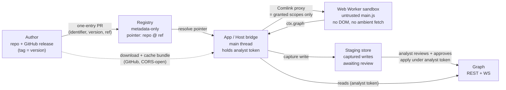

# Architecture & principles

Vineyard는 플러그인과 Type Pack을 **서버가 아닌 사용자의 앱에서** 실행합니다. 이 페이지는 설계 사실을 설명하고, 작성자 → 레지스트리 → 앱 → 실행 흐름을 추적하며, 현재 범위와 연기된 항목을 나열합니다.

## 설계 사실

- **클라이언트 측 실행.** 플러그인(JS)과 Type Pack(JSON)은 사용자 앱에서 실행됩니다. 현재는 브라우저, 추후에는 데스크톱 앱입니다. 서버는 플러그인 코드를 절대 실행하지 않으며, 포인터를 저장하고 일반 그래프 API를 제공합니다.
- **플러그인별 플랫폼 플래그.** 플러그인은 `platforms.web` 및/또는 `platforms.desktop`을 통해 지원되는 플랫폼을 선언합니다. 브라우저가 제공할 수 없는 기능은 **데스크톱** 런타임을 대상으로 하거나 단일 **web-proxy** 엔드포인트를 제공합니다.
- **메타데이터 전용 레지스트리.** 배포는 코드가 아닌 포인터의 레지스트리 + GitHub입니다. 클라이언트는 GitHub에서 번들을 다운로드하고 로컬에 캐시하여 실행합니다. [distribution](distribution.md)을 참조하세요.
- **기본적으로 임시.** 작업은 Postgres에 기록되지 않으며, 현재 브라우저 탭에만 존재합니다. 저장은 선택적(opt-in)입니다. [lifecycle](lifecycle.md)을 참조하세요.
- **최소 권한.** 신뢰할 수 없는 플러그인 JS는 선언된 스코프(`graph` 동사, `network`, `web_probe`(데스크톱), `config`)만으로 Web Worker 샌드박스에서 실행되며, 호스트 브리지를 통해 접근합니다. 워커 자체에는 DOM도, 주변 `fetch`도, 계정 토큰도 없습니다. 그래프 쓰기는 **실시간이 아니라 스테이징**됩니다. 브리지가 쓰기를 캡처하고, 분석가가 변경 세트를 검토하고 승인한 뒤에야 분석가 본인의 토큰으로 API에 도달합니다. [scopes](../reference/scopes.md) 및 [security](security.md)를 참조하세요.

## 엔드 투 엔드 흐름

플러그인의 수명 주기는 **작성자**, **레지스트리**, **앱**(호스트), 코드가 실제 실행되는 **샌드박스**, 그리고 샌드박스에서 나온 결과를 승인하는 **분석가**의 다섯 가지 행위자에 걸쳐 있습니다.

1. **작성자 → 레지스트리.** 작성자는 매니페스트 `version`과 동일한 태그의 GitHub 릴리스에 플러그인을 게시한 다음, 설치 레코드 `{ identifier, version, ref }`를 추가하는 단일 항목 풀 리퀘스트를 엽니다. 레지스트리는 코드가 아닌 포인터(`repository @ ref`)를 저장합니다.

2. **레지스트리 → 앱.** 사용자가 설치하면 앱이 포인터를 확인하고 **GitHub에서 직접 번들을 다운로드**하며, 선택적 `integrity` 해시를 검증한 후 로컬에 캐시합니다. 서버 측 콘텐츠 복사본은 존재하지 않습니다.

3. **앱 → 샌드박스.** 호스트는 캐시된 `main.js`를 전용 모듈 **Web Worker**에 로드합니다. 메인 스레드(*HostBridge*)는 분석가의 토큰을 보유하고 형태가 **정확히 부여된 스코프**인 [Comlink](https://github.com/GoogleChromeLabs/comlink) 프록시를 노출합니다 — `ctx` 멤버는 해당 스코프가 부여되지 않으면 존재하지 않으므로 우회할 수 있는 것이 없습니다.

4. **실행 → 스테이징 → 그래프.** 플러그인은 `ctx.graph`를 호출합니다. 읽기는 WebSocket이 이미 채워 둔 인메모리 스토어에서 제공되고, 쓰기는 **전송되는 대신 스테이징 스토어에 캡처**됩니다. 분석가가 변경 세트를 열어 항목별로 검토하고 승인해야 비로소 REST API에 도달하며, 이때 적용은 **분석가 본인의 토큰**으로 실행되므로 그 쓰기는 분석가의 것입니다. `ctx.net` 아웃바운드 요청은 문자열 접두사가 아니라 파싱된 오리진과 경로 세그먼트 경계를 기준으로 플러그인이 선언한 엔드포인트와 대조되며, 데스크톱 셸은 그 위에 CSP를 추가합니다. 워커는 토큰도 백엔드 URL도 절대 볼 수 없습니다.

`ctx` 인터페이스에 대해서는 [SDK](sdk.md)를, 실행이 작업 상태를 통해 어떻게 이동하는지는 [lifecycle](lifecycle.md)을 참조하세요. 샌드박스 경계가 어떻게 강제되는지(이그레스 허용목록, 워커에 계정 토큰 없음, 서버 측 권한 검사)는 [security](security.md)를 참조하세요.

## 현재 범위 vs. 연기됨

!!! warning "구현 범위"
    브라우저와 데스크톱 Electron 셸은 현재 모두 배포되어 있습니다. 여러 항목(아래 연기됨으로 표시)은 스키마에 미래 지향적 설계로 남아 있지만 **아직 빌드되지 않았습니다** — 배포된 것으로 취급하지 마세요.

=== "현재 범위"

    - **브라우저 런타임** — `platforms.web.runtime: "sandbox-js"`: 작성자 JS가 Web Worker에서 실행됩니다.
    - **데스크톱 런타임** — `platforms.desktop.runtime: "sandbox-js"`: 사용자 정의 `app://` 스킴, 강화된 렌더러(샌드박스, contextIsolation), CORS 헤더 재작성, 익명 SSRF 방지 HTTP 프로브(`web_probe` 기능)를 갖춘 Electron 셸.
    - GitHub 호스팅, 로컬 캐시 번들을 사용하는 **메타데이터 전용 레지스트리**.
    - **스테이징된 그래프 쓰기 + 분석가 검토** — 캡처된 노드/엣지 변경을 승인 후에만 적용 — 그리고 이그레스 허용목록과 서버 측 권한 강제.
    - **임시, 클라이언트 측 작업 큐**(Web Worker 풀, 다중 탭 단일 실행).
    - **6개의 Chaos 참조 플러그인**, [CIDR Expand](plugin-manifest.md), [Infrastructure](../guide/typepacks.md) / [Threat](../guide/typepacks.md) Type Pack.

=== "연기됨 (설계됨, 빌드되지 않음)"

    - **`native`/`subprocess` 데스크톱 런타임** — `platforms.desktop.runtime: "native"` 및 `"subprocess"`는 스키마에서 허용되지만 아직 구현되지 않았습니다. `sandbox-js` 데스크톱 런타임은 현재 배포되어 있습니다.
    - **`web-proxy` 런타임** — 타사 API가 필요한 웹 플러그인을 위한 단일 엔드포인트 CORS 탈출구.
    - **키체인 기반 시크릿 설정** — 데스크톱 키체인에서 주입되는 `config.secret:true` 값 (BYOK).
    - **선택적 작업 지속성**(`TaskSnapshot`) 및 SPEC §14에 포함된 미해결 이슈(Type Pack 버전 고정, 웹에서 딥 링크, 장기 실행 + 임시 재로드 생존).

현재 배포된 플랫폼을 대상으로 할 때는 `sandbox-js`를 사용하는 `web` 블록과 함께 `platforms.primary: "web"`을 선언하거나, Electron용 `desktop` 블록을 추가하세요. 설치 프로그램은 사용자 앱이 실행할 수 없는 플랫폼의 플러그인을 숨기지 않고 **회색으로 표시**하며, 플랫폼별 `fallback` 힌트를 사용합니다. [plugin manifest](plugin-manifest.md)를 참조하세요.

## 다음 / 참고

- [Security model](security.md) — 샌드박스, 이그레스 허용목록, 스테이징된 쓰기, 시크릿 처리.
- [Scopes (reference)](../reference/scopes.md) — 권한 문자열과 해당 `ctx` 매핑.
- [Distribution & storage](distribution.md) — GitHub + 메타데이터 전용 레지스트리, 무결성 해시.
- [Quickstart](quickstart.md) — 첫 번째 플러그인 빌드 및 사이드로드.
- [Home](../index.md) · [Marketplace](../marketplace.md)
