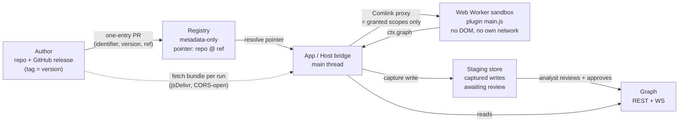

# Architecture & principles

Vineyard는 플러그인과 Type Pack을 **서버가 아닌 사용자의 앱에서** 실행합니다.

## 설계 사실

- **클라이언트 측 실행.** 플러그인(JS)과 Type Pack(JSON)은 사용자 앱, 즉 브라우저 또는 데스크톱 앱에서 실행됩니다. 서버는 플러그인 코드를 절대 실행하지 않으며, 포인터를 저장하고 일반 그래프 API를 제공합니다.
- **플러그인별 플랫폼 플래그.** 플러그인은 `platforms.web` 및/또는 `platforms.desktop`을 통해 지원되는 플랫폼을 선언합니다. 브라우저가 제공할 수 없는 기능은 **데스크톱** 런타임을 대상으로 합니다.
- **메타데이터 전용 레지스트리.** 배포는 코드가 아닌 포인터의 레지스트리 + GitHub입니다. 클라이언트는 번들을 가져와(jsDelivr 경유, 불변 커밋 SHA에 고정) 바로 실행합니다. [distribution](distribution.md)을 참조하세요.
- **기본적으로 임시.** 작업은 현재 브라우저 탭의 메모리에만 존재하며, Postgres에는 아무것도 기록되지 않습니다. [lifecycle](lifecycle.md)을 참조하세요.
- **최소 권한.** 플러그인 JS는 선언된 스코프(`graph` 동사, `network`, `web_probe`(데스크톱), `services`, `config`)만으로 Web Worker 샌드박스에서 실행되며, 워커에는 DOM도 자체 네트워크도 없습니다. 그래프 쓰기는 **실시간이 아니라 스테이징**되며, 분석가가 변경 세트를 검토하고 승인한 뒤에야 적용됩니다. [scopes](../reference/scopes.md) 및 [security](security.md)를 참조하세요.

## 엔드 투 엔드 흐름

```mermaid
flowchart LR
    A["Author<br/>repo + GitHub release<br/>(tag = version)"]
    R["Registry<br/>metadata-only<br/>pointer: repo @ ref"]
    H["App / Host bridge<br/>main thread"]
    W["Web Worker sandbox<br/>plugin main.js<br/>no DOM, no own network"]
    S["Staging store<br/>captured writes<br/>awaiting review"]
    G["Graph<br/>REST + WS"]

    A -- "one-entry PR<br/>(identifier, version, ref)" --> R
    R -- "resolve pointer" --> H
    A -. "fetch bundle per run<br/>(jsDelivr, CORS-open)" .-> H
    H -- "Comlink proxy<br/>= granted scopes only" --> W
    W -- "ctx.graph" --> H
    H -- "capture write" --> S
    S -- "analyst reviews + approves" --> G
    H -- "reads" --> G
```

1. **작성자 → 레지스트리.** 작성자는 매니페스트 `version`과 동일한 태그의 GitHub 릴리스에 플러그인을 게시한 다음, 설치 레코드 `{ identifier, version, ref }`를 추가하는 단일 항목 풀 리퀘스트를 엽니다. 레지스트리는 코드가 아닌 포인터(`repository @ ref`)를 저장합니다.

2. **레지스트리 → 앱.** 사용자가 설치하면 앱이 포인터를 확인하고 번들을 직접 가져옵니다(jsDelivr 경유, 불변 커밋 SHA에 고정). 서버 측 콘텐츠 복사본은 존재하지 않습니다.

3. **앱 → 샌드박스.** 호스트는 가져온 `main.js`를 전용 모듈 **Web Worker**에 로드하고, 형태가 **정확히 부여된 스코프**인 [Comlink](https://github.com/GoogleChromeLabs/comlink) 프록시로 `ctx`를 노출합니다 — `ctx` 멤버는 해당 스코프가 부여되지 않으면 존재하지 않습니다.

4. **실행 → 스테이징 → 그래프.** 플러그인은 `ctx.graph`를 호출합니다. 읽기는 프로젝트의 인메모리 그래프에서 제공되고, 쓰기는 **전송되는 대신 스테이징 스토어에 캡처**됩니다. 분석가가 변경 세트를 열어 항목별로 검토하고 승인해야 비로소 적용됩니다. `ctx.net.fetch` 아웃바운드 요청은 문자열 접두사가 아니라 오리진과 온전한 경로 세그먼트 단위로 플러그인이 선언한 엔드포인트와 대조됩니다. 워커에는 자체 네트워크가 없으므로 직접 호출한 `fetch`는 실패합니다. `ctx`를 거치세요.

`ctx` 인터페이스는 [SDK](sdk.md)를, 실행이 작업 상태를 통해 어떻게 이동하는지는 [lifecycle](lifecycle.md)을, 샌드박스 경계는 [security](security.md)를 참조하세요.

## 현재 범위 vs. 연기됨

!!! warning "구현 범위"
    브라우저와 데스크톱 Electron 셸은 현재 모두 배포되어 있습니다. 아래 연기됨으로 표시된 항목은 스키마에 미래 지향적 설계로 남아 있지만 **아직 빌드되지 않았습니다** — 배포된 것으로 취급하지 마세요.

### 현재 배포됨

- **브라우저 런타임** — `platforms.web.runtime: "sandbox-js"`: 작성자 JS가 Web Worker에서 실행됩니다.
- **데스크톱 런타임** — `platforms.desktop.runtime: "sandbox-js"`: 익명 HTTP 프로브(`web_probe` 기능)가 추가되는 Electron 데스크톱 앱.
- GitHub 호스팅 번들을 jsDelivr로(불변 커밋 SHA 고정) 가져오는 **메타데이터 전용 레지스트리**.
- **스테이징된 그래프 쓰기 + 분석가 검토** — 캡처된 노드/엣지 변경을 승인 후에만 적용 — 그리고 이그레스 허용목록.
- **클라이언트 측 작업 실행, 실행마다 전용 Web Worker 1개.**
- **시크릿 설정** — 로그인한 계정별로(데스크톱은 OS 키체인, 브라우저는 탭 세션 동안) 보관되어 선언한 플러그인이 읽는 `config.secret:true` 값 (BYOK).
- **6개의 Chaos 참조 플러그인**, [Infrastructure](../guide/typepacks.md) / [Threat](../guide/typepacks.md) Type Pack.

### 연기됨 (설계됨, 빌드되지 않음)

- **`native`/`subprocess` 데스크톱 런타임** — `platforms.desktop.runtime: "native"` 및 `"subprocess"`는 스키마에서 허용되지만 아직 구현되지 않았습니다.
- **`web-proxy` 런타임** — 타사 API가 필요한 웹 플러그인을 위한 단일 엔드포인트 CORS 탈출구.
- **Type Pack 버전 고정** — [Type Packs](typepacks.md) 참조.

현재 배포된 플랫폼을 대상으로 할 때는 플러그인에 `sandbox-js`를 사용하는 `web` 블록을 두세요. 그 `entry`가 브라우저와 데스크톱 앱 모두에서 실행되며, 이것이 없는 팩 멤버는 팩의 것을 상속합니다. 플러그인을 데스크톱 전용으로 표시하려면 `platforms.primary: "desktop"`을 설정하세요 — 그러면 브라우저의 **Run plugins** 대화상자가 그 플러그인을 숨기지 않고 "Desktop only — …" 사유와 함께 **회색으로 표시**합니다. 플랫폼별 `fallback` 힌트는 앱이 읽지 않습니다. [plugin manifest](plugin-manifest.md)를 참조하세요.

## 다음 / 참고

- [Security model](security.md) — 샌드박스, 이그레스 허용목록, 스테이징된 쓰기, 시크릿 처리.
- [Scopes (reference)](../reference/scopes.md) — 권한 문자열과 해당 `ctx` 매핑.
- [Distribution & storage](distribution.md) — GitHub + 메타데이터 전용 레지스트리.
- [Quickstart](quickstart.md) — 첫 번째 플러그인 빌드 및 사이드로드.
- [Home](../index.md) · [Marketplace](../marketplace.md)
