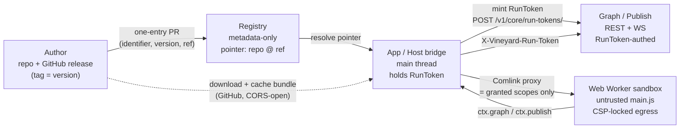

# Architecture & principles

Vineyard executes plugins and Type Packs **in the user's app**, never on a server. This page states the design facts, traces the author → registry → app → execution flow, and lists what is in scope today versus deferred.

## Design facts

- **Client-side execution.** Plugins (JS) and Type Packs (JSON) run in the user's app — the browser now, a desktop app later. The server never executes plugin code; it stores pointers and brokers a scoped write token.
- **Per-plugin platform flags.** A plugin declares supported platforms via `platforms.web` and/or `platforms.desktop`. A capability the browser cannot provide either targets the **desktop** runtime or ships a single **web-proxy** endpoint.
- **Metadata-only registry.** Distribution is GitHub + a registry of pointers, not code. The client downloads the bundle from GitHub and caches it locally to run. See [distribution](distribution.md).
- **Ephemeral by default.** A task is not written to Postgres; it lives in the current browser tab. Saving is opt-in. See [lifecycle](lifecycle.md).
- **Least authority.** Untrusted plugin JS runs in a Web Worker sandbox with only its declared scopes, reached through a host bridge holding a one-time scoped RunToken — never the user's account token. See [scopes](../reference/scopes.md) and [security](security.md).

## End-to-end flow

The lifecycle of a plugin spans four actors: the **author**, the **registry**, the **app** (host), and the **sandbox** where code actually runs.

1. **Author → registry.** The author publishes the plugin to a GitHub release whose tag equals the manifest `version`, then opens a one-entry pull request adding an install record `{ identifier, version, ref }`. The registry stores the pointer (`repository @ ref`), never the code.

2. **Registry → app.** When a user installs, the app resolves the pointer and **downloads the bundle directly from GitHub**, verifying the optional `integrity` hash, then caches it locally. No server-side content copy exists.

3. **App → sandbox.** The host loads the cached `main.js` into a dedicated module **Web Worker**. The main thread (the *HostBridge*) holds the scoped token and exposes a [Comlink](https://github.com/GoogleChromeLabs/comlink) proxy whose shape is **exactly the granted scopes** — a `ctx` member is absent unless its scope was granted, so there is nothing to bypass.

4. **Execution → graph.** The plugin calls `ctx.graph` / `ctx.publish`; the bridge attaches the `X-Vineyard-Run-Token` to the REST write and the worker never sees a token. A leaked token is at most a short-TTL, project-scoped, write-capped credential.

See [SDK](sdk.md) for the `ctx` interface and [lifecycle](lifecycle.md) for how a run moves through the task states. For how the sandbox boundary is enforced (CSP egress, no account token in the worker, server-side permission checks), see [security](security.md).

## In scope now vs. deferred

!!! warning "Implementation scope (now): browser only"
    The first build targets the **browser** runtime exclusively. Several items remain in the schemas as forward-looking design but are **not built yet** — do not treat them as shipped.

=== "In scope now"

    - **Browser runtime** — `platforms.web.runtime: "sandbox-js"`: author JS runs in a Web Worker.
    - **Metadata-only registry** with GitHub-hosted, locally cached bundles.
    - **One-time scoped RunToken** + server-side permission enforcement.
    - **Ephemeral, client-side task queue** (Web Worker pool, multi-tab single-execution).
    - **The six Chaos reference plugins**, [CIDR Expand](plugin-manifest.md), and the [Infrastructure](../guide/typepacks.md) / [Threat](../guide/typepacks.md) Type Packs.

=== "Deferred (designed, not built)"

    - **Desktop runtime** — `platforms.desktop` blocks (`sandbox-js` / `native` / `subprocess`) are allowed by the schema but not yet implemented.
    - **`web-proxy` runtime** — the single-endpoint CORS escape hatch for web plugins that need a third-party API.
    - **Opt-in task persistence** (`TaskSnapshot`), secret config via desktop keychain, and the open issues carried in SPEC §14 (Type Pack version pinning, deep-link on web, long-running + ephemeral reload survival).

When you target only what ships today, declare `platforms.primary: "web"` with a `web` block using `sandbox-js`. The installer **greys out** (does not hide) plugins whose platforms a user's app cannot run, using the per-platform `fallback` hint. See [plugin manifest](plugin-manifest.md).

## Next / See also

- [Security model](security.md) — sandbox, CSP egress, RunToken, secret handling.
- [Scopes (reference)](../reference/scopes.md) — the authority strings and their `ctx` mapping.
- [Distribution & storage](distribution.md) — GitHub + metadata-only registry, integrity hashes.
- [Quickstart](quickstart.md) — build and sideload your first plugin.
- [Home](../index.md) · [Marketplace](../marketplace.md)
