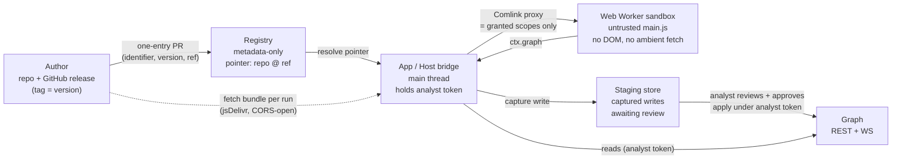

# Architecture & principles

Vineyard executes plugins and Type Packs **in the user's app**, never on a server.

## Design facts

- **Client-side execution.** Plugins (JS) and Type Packs (JSON) run in the user's app — the browser now, a desktop app later. The server never executes plugin code; it stores pointers and serves the ordinary graph API.
- **Per-plugin platform flags.** A plugin declares supported platforms via `platforms.web` and/or `platforms.desktop`. A capability the browser cannot provide either targets the **desktop** runtime or ships a single **web-proxy** endpoint.
- **Metadata-only registry.** Distribution is GitHub + a registry of pointers, not code. The client fetches the bundle (via jsDelivr, pinned to the immutable commit SHA) and runs it directly. See [distribution](distribution.md).
- **Ephemeral by default.** A task lives in the current browser tab's memory; nothing is written to Postgres. See [lifecycle](lifecycle.md).
- **Least authority.** Untrusted plugin JS runs in a Web Worker sandbox with only its declared scopes — `graph` verbs, `network`, `web_probe` (desktop), `config` — reached through a host bridge; the worker itself gets no DOM, no ambient `fetch` and no account token. Graph writes are **staged, not live**: the bridge captures them, and they reach the API only after the analyst reviews the change set and approves it, under the analyst's own token. See [scopes](../reference/scopes.md) and [security](security.md).

## End-to-end flow

```mermaid
flowchart LR
    A["Author<br/>repo + GitHub release<br/>(tag = version)"]
    R["Registry<br/>metadata-only<br/>pointer: repo @ ref"]
    H["App / Host bridge<br/>main thread<br/>holds analyst token"]
    W["Web Worker sandbox<br/>untrusted main.js<br/>no DOM, no ambient fetch"]
    S["Staging store<br/>captured writes<br/>awaiting review"]
    G["Graph<br/>REST + WS"]

    A -- "one-entry PR<br/>(identifier, version, ref)" --> R
    R -- "resolve pointer" --> H
    A -. "fetch bundle per run<br/>(jsDelivr, CORS-open)" .-> H
    H -- "Comlink proxy<br/>= granted scopes only" --> W
    W -- "ctx.graph" --> H
    H -- "capture write" --> S
    S -- "analyst reviews + approves<br/>apply under analyst token" --> G
    H -- "reads (analyst token)" --> G
```

1. **Author → registry.** The author publishes the plugin to a GitHub release whose tag equals the manifest `version`, then opens a one-entry pull request adding an install record `{ identifier, version, ref }`. The registry stores the pointer (`repository @ ref`), never the code.

2. **Registry → app.** When a user installs, the app resolves the pointer and fetches the bundle directly (via jsDelivr, pinned to the immutable commit SHA). No server-side content copy exists.

3. **App → sandbox.** The host loads the fetched `main.js` into a dedicated module **Web Worker**. The main thread (the *HostBridge*) holds the analyst's token and exposes a [Comlink](https://github.com/GoogleChromeLabs/comlink) proxy whose shape is **exactly the granted scopes** — a `ctx` member is absent unless its scope was granted, so there is nothing to bypass.

4. **Execution → staging → graph.** The plugin calls `ctx.graph`. Reads are served from the in-memory stores the WebSocket already populates; writes are **captured into the staging store rather than sent**. They reach the REST API only once the analyst opens the change set, goes through it item by item and approves — the apply then runs under the **analyst's own token**, so the write is theirs. Outbound `ctx.net` requests are matched against the plugin's declared endpoints on the parsed origin plus a path-segment boundary, never as a string prefix; the desktop shell adds a CSP on top. The worker never sees a token or a backend URL.

See [SDK](sdk.md) for the `ctx` interface and [lifecycle](lifecycle.md) for how a run moves through the task states. For how the sandbox boundary is enforced (egress allowlist, no account token in the worker, server-side permission checks), see [security](security.md).

## In scope now vs. deferred

!!! warning "Implementation scope"
    The browser and desktop Electron shell both ship today. Items listed as deferred below remain in the schemas as forward-looking design but are **not built yet** — do not treat them as shipped.

### Ships today

- **Browser runtime** — `platforms.web.runtime: "sandbox-js"`: author JS runs in a Web Worker.
- **Desktop runtime** — `platforms.desktop.runtime: "sandbox-js"`: Electron shell with custom `app://` scheme, hardened renderer (sandbox, contextIsolation), CORS header rewriting, and anonymous SSRF-guarded HTTP probe (`web_probe` capability).
- **Metadata-only registry** with GitHub-hosted bundles fetched via jsDelivr, pinned to an immutable commit SHA.
- **Staged graph writes + analyst review** — captured node/edge changes, applied only on approval — plus the egress allowlist and server-side permission enforcement.
- **Client-side task execution, one dedicated Web Worker per run.**
- **Keychain-backed secret config** — `config.secret:true` values injected from the desktop keychain (BYOK, desktop only).
- **The six Chaos reference plugins** and the [Infrastructure](../guide/typepacks.md) / [Threat](../guide/typepacks.md) Type Packs.

### Deferred (designed, not built)

- **`native`/`subprocess` desktop runtimes** — `platforms.desktop.runtime: "native"` and `"subprocess"` are allowed by the schema but not yet implemented. The `sandbox-js` desktop runtime ships today.
- **`web-proxy` runtime** — the single-endpoint CORS escape hatch for web plugins that need a third-party API.
- **Type Pack version pinning** — see [Type Packs](typepacks.md).

When targeting platforms that ship today, declare `platforms.primary: "web"` with a `web` block using `sandbox-js`, or add a `desktop` block for Electron. The installer **greys out** (does not hide) plugins whose platforms a user's app cannot run, using the per-platform `fallback` hint. See [plugin manifest](plugin-manifest.md).

## Next / See also

- [Security model](security.md) — sandbox, egress allowlist, staged writes, secret handling.
- [Scopes (reference)](../reference/scopes.md) — the authority strings and their `ctx` mapping.
- [Distribution & storage](distribution.md) — GitHub + metadata-only registry.
- [Quickstart](quickstart.md) — build and sideload your first plugin.
- [Home](../index.md) · [Marketplace](../marketplace.md)
