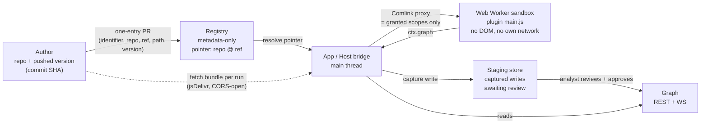

# Architecture & principles

Vineyard executes plugins and Type Packs **in the user's app**, never on a server.

## Design facts

- **Client-side execution.** Plugins (JS) and Type Packs (JSON) run in the user's app, in the browser or in the desktop app. The server never executes plugin code; it stores pointers and serves the ordinary graph API.
- **Per-plugin platform flags.** A plugin declares supported platforms via `platforms.web` and/or `platforms.desktop`. A capability the browser cannot provide targets the **desktop** runtime.
- **Metadata-only registry.** Distribution is GitHub + a registry of pointers, not code. The client fetches the bundle (via jsDelivr, pinned to the immutable commit SHA) and runs it directly. See [distribution](distribution.md).
- **Ephemeral by default.** A plugin-run task lives only in the current tab's memory; AI conversations (and their task rows) are kept on this device. Neither is sent to the server — only applied changes reach the project's graph. See [lifecycle](lifecycle.md) and [Tasks](../guide/tasks.md).
- **Least authority.** Plugin JS runs in a Web Worker sandbox with only its declared scopes — `graph` verbs, `network`, `web_probe` (desktop), `services`, `config`; the worker has no DOM and no network of its own. Graph writes are **staged, not live**: they are applied only after the analyst reviews and approves the change set. See [scopes](../reference/scopes.md) and [security](security.md).

## End-to-end flow

```mermaid
flowchart LR
    A["Author<br/>repo + pushed version<br/>(commit SHA)"]
    R["Registry<br/>metadata-only<br/>pointer: repo @ ref"]
    H["App / Host bridge<br/>main thread"]
    W["Web Worker sandbox<br/>plugin main.js<br/>no DOM, no own network"]
    S["Staging store<br/>captured writes<br/>awaiting review"]
    G["Graph<br/>REST + WS"]

    A -- "one-entry PR<br/>(identifier, repo, ref, path, version)" --> R
    R -- "resolve pointer" --> H
    A -. "fetch bundle per run<br/>(jsDelivr, CORS-open)" .-> H
    H -- "Comlink proxy<br/>= granted scopes only" --> W
    W -- "ctx.graph" --> H
    H -- "capture write" --> S
    S -- "analyst reviews + approves" --> G
    H -- "reads" --> G
```

1. **Author → registry.** The author pushes the version to their repo, then opens a one-entry pull request adding `packs/<identifier>.json` — `{ identifier, repo, ref, path, version, … }`, where `ref` is the commit SHA of that version. The registry stores the pointer (`repo @ ref`), never the code.

2. **Registry → app.** When a user installs, the app resolves the pointer and fetches the bundle directly (via jsDelivr, pinned to the immutable commit SHA). No server-side content copy exists.

3. **App → sandbox.** The host loads the fetched `main.js` into a dedicated module **Web Worker** and exposes `ctx` as a [Comlink](https://github.com/GoogleChromeLabs/comlink) proxy whose shape is **exactly the granted scopes** — a `ctx` member is absent unless its scope was granted.

4. **Execution → staging → graph.** The plugin calls `ctx.graph`. Reads are served from the project's in-memory graph; writes are **captured into the staging store rather than sent**. They are applied only once the analyst opens the change set, goes through it item by item and approves. Outbound `ctx.net.fetch` requests are matched against the plugin's declared endpoints by origin and whole path segments, never as a string prefix. The worker has no network of its own, so a direct `fetch` fails; go through `ctx`.

See [SDK](sdk.md) for the `ctx` interface, [lifecycle](lifecycle.md) for how a run moves through the task states, and [security](security.md) for the sandbox boundary.

## In scope now vs. deferred

!!! warning "Implementation scope"
    The browser and desktop Electron shell both ship today. Items listed as deferred below remain in the schemas as forward-looking design but are **not built yet** — do not treat them as shipped.

### Ships today

- **Browser runtime** — `platforms.web.runtime: "sandbox-js"`: author JS runs in a Web Worker.
- **Desktop runtime** — `platforms.desktop.runtime: "sandbox-js"`: the Electron desktop app, which adds the anonymous HTTP probe (`web_probe` capability).
- **Metadata-only registry** with GitHub-hosted bundles fetched via jsDelivr, pinned to an immutable commit SHA.
- **Staged graph writes + analyst review** — captured node/edge changes, applied only on approval — plus the egress allowlist.
- **Client-side task execution, one dedicated Web Worker per run.**
- **Secret config** — `config.secret:true` values kept per signed-in account (in the OS keychain on desktop, for the tab session in the browser) and read by the declaring plugin (BYOK).
- **The six Chaos reference plugins** and the [Infrastructure](../guide/typepacks.md) / [Threat](../guide/typepacks.md) Type Packs.

### Deferred (designed, not built)

- **`native`/`subprocess` desktop runtimes** — `platforms.desktop.runtime: "native"` and `"subprocess"` are allowed by the schema but not yet implemented.
- **`web-proxy` runtime** — the single-endpoint CORS escape hatch for web plugins that need a third-party API.
- **Type Pack version pinning** — see [Type Packs](typepacks.md).

When targeting platforms that ship today, give the plugin a `web` block using `sandbox-js`: its `entry` is what runs in both the browser and the desktop app, and a pack member without one inherits the pack's. To mark a plugin desktop-only, set `platforms.primary: "desktop"` — in the browser the **Run plugins** dialog then **greys it out** (does not hide it) with the reason "Desktop only — …". The per-platform `fallback` hint is not read by the app. See [plugin manifest](plugin-manifest.md).

## Next / See also

- [Security model](security.md) — sandbox, egress allowlist, staged writes, secret handling.
- [Scopes (reference)](../reference/scopes.md) — the authority strings and their `ctx` mapping.
- [Distribution & storage](distribution.md) — GitHub + metadata-only registry.
- [Quickstart](quickstart.md) — build and sideload your first plugin.
- [Home](../index.md) · [Marketplace](../marketplace.md)
