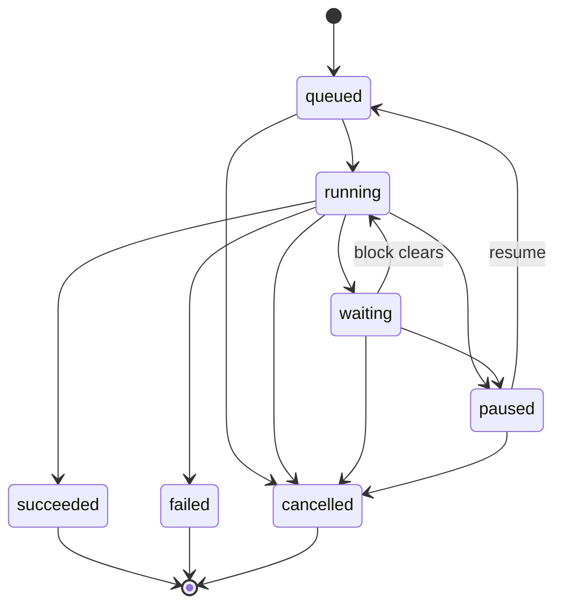

# Task lifecycle

Vineyard의 모든 플러그인 실행과 모든 AI 채팅 턴은 하나의 클라이언트 측 큐에 있는 **작업(task)**입니다. 이 페이지는 7가지 작업 상태, 그들 간의 합법적인 전환, 협력적 취소 작동 방식, 재시도가 새 작업을 발행하는 이유, 그리고 작업 상태가 실제로 어디에 존재하는지 문서화합니다.

## 하나의 클라이언트 측 큐

작업은 클라이언트에서 실행됩니다:

- **동시성 한도**가 있는 **Web Worker 풀**이 한도까지 작업을 병렬로 실행합니다. 나머지는 `queued`로 대기합니다.
- **멀티 탭 단일 실행**이 **Web Locks API**를 통해 강제되므로, 동일한 프로젝트가 두 탭에 열려 있을 때 작업이 두 번 실행되지 않습니다.
- 플러그인 실행과 AI 채팅 턴 모두 이 하나의 큐를 공유합니다 — Tasks 패널이 이들을 함께 표시합니다. 사용자 대상 보기는 [guide/tasks](../guide/tasks.md)를 참조하세요.

## 7가지 상태

`TaskState`는 `sdk/types.ts`에 정의되어 있습니다([SDK](sdk.md) 참조):

```ts
type TaskState =
  | "queued" | "running" | "waiting"
  | "paused" | "succeeded" | "failed" | "cancelled";
```

| 상태 | 의미 |
| --- | --- |
| `queued` | 수락됨, 동시성 한도 아래 빈 워커 슬롯 대기 중. |
| `running` | 워커에서 실행 중. |
| `waiting` | 외부 요소에 의해 차단됨. 차단이 해제되면 자동 재개. 대기 중에 워커 슬롯이 **해제될 수 있음**. |
| `paused` | 사용자에 의해 일시 중단됨. Resume 시 큐에 재진입. |
| `succeeded` | 정상 완료. **종료 상태.** |
| `failed` | 오류로 완료. **종료 상태.** |
| `cancelled` | 협력적으로 중지됨(또는 백스톱에 의해). **종료 상태.** |

## 전환 테이블

```text
queued  → running | cancelled
running → waiting | paused | succeeded | failed | cancelled
waiting → running | paused | cancelled        (차단 해제 시 자동 재개)
paused  → queued  | cancelled
succeeded | failed | cancelled = 종료
```



!!! note "`paused`는 재큐잉되며 직접 재개되지 않습니다"
    `paused` 작업을 재개하면 `queued`로 돌아가며, 워커 슬롯을 다시 획득해야 합니다. 반면 `waiting` 작업은 차단이 해제되면 (한도에 따라) `running`으로 바로 **자동 재개**됩니다.

## `waiting`은 일반화되었습니다

`waiting`은 HTTP `Retry-After` 백오프 이상입니다. 차단 이유는 다음 중 하나입니다:

| 이유 | 트리거 |
| --- | --- |
| `rate_limit` | HTTP 429 / `Retry-After`. 백오프의 단일 진입점은 [`ctx.net.fetchWithBackoff()`](sdk.md)입니다. |
| `awaiting_user_input` | 계속하기 전에 실행에 추가 입력이 필요합니다. |
| `external_poll` | 준비될 때까지 외부 작업/리소스를 폴링합니다. |
| `cors_blocked` | 웹 요청이 브라우저 교차 출처 정책에 의해 차단되었습니다. |
| `token_refresh` | 범위 지정 자격 증명이 갱신 중입니다. |

작업이 `waiting` 상태일 때 슬롯이 해제될 수 있으므로, 긴 백오프가 동시성 한도를 점유하지 않습니다 — 그동안 다른 큐잉된 작업이 실행될 수 있습니다. Tasks 패널은 대기 중인 작업에 대해 **Resume-now**와 **카운트다운**을 노출합니다.

## 취소는 협력적입니다

작업 중지는 Web `AbortController` / `AbortSignal` 쌍 위에 구축된 **협력적** 방식입니다:

- 호스트가 컨트롤러를 중단합니다. 플러그인은 `ctx.signal`(`AbortSignal`)을 관찰하거나 `ctx.onCancel(handler)`을 등록합니다.
- 잘 동작하는 플러그인은 작업 단위 사이에 `ctx.signal.aborted`를 확인하고 깔끔하게 해제하며, 부분 결과를 보존합니다.

`ctx.signal` 체크포인트 예제는 [SDK](sdk.md)를 참조하세요.

!!! warning "사용자 Stop에 `worker.terminate()`를 사용하지 마세요"
    사용자 Stop 시 워커를 강제 종료하면 부분 결과가 버려집니다. 호스트는 일반 Stop에 `worker.terminate()`를 호출하지 **않습니다**. 이는 중단 신호를 따르기를 거부하는 워커를 위한 **최후의 수단 타임아웃 백스톱**으로 예약되어 있습니다. `run()`을 중단 가능하게 설계하세요 — [SDK](sdk.md) 및 [매니페스트의 lifecycle controls](plugin-manifest.md)를 참조하세요.

## 재시도는 상태가 아닙니다

`retry` 상태도 없고 제자리 재시작도 없습니다. 종료된 작업을 재시도하면 `retry_of: <prevId>`를 기록하는 **완전히 새로운 작업**이 발행됩니다. 원래 종료 레코드는 그대로 남아 있으므로, 해당 (임시) 결과와 로그가 계속 검사 가능합니다. AI 턴은 동일한 정신으로 **Reopen**을 제공합니다.

Tasks 패널의 상태별 컨트롤:

| 상태 | 컨트롤 |
| --- | --- |
| `queued` | Cancel |
| `running` | Stop / Pause (+ 스피너, 진행률) |
| `waiting` | Resume-now / Cancel (+ 카운트다운) |
| `paused` | Resume / Cancel |
| `succeeded` / `failed` / `cancelled` | Retry / (AI) Reopen / Save-to-history |

## 임시 저장 계층

작업 상태는 **기본적으로 임시**입니다. 권위 순서대로 세 계층이 있습니다:

=== "Tier 1 — 탭 메모리"
    **권위 있는** 저장소는 인탭 `zustand` 저장소입니다. 실시간 상태, 진행률, 결과가 탭 세션 기간 동안 여기에 존재합니다.

=== "Tier 2 — IndexedDB 미러 (선택적)"
    **선택적, 스크럽된** IndexedDB 미러는 인탭 리로드에서도 상태가 생존하도록 존재합니다. 이는 **캐시**입니다: 어디에도 동기화되지 않으며 진실 공급원이 아닙니다.

=== "Tier 3 — Postgres (opt-in 전용)"
    기본적으로 Postgres는 작업에 대해 **아무것도** 저장하지 않습니다. 명시적인 사용자 주도 **Save**가 단일 소독된 `TaskSnapshot` 행을 기록합니다. 해당 작업 없이는 아무것도 기록되지 않습니다.

!!! tip "AI 채팅은 상태 비저장 스트리밍입니다"
    이 모델에서 `AIChatView`는 **상태 비저장 스트리밍**(`POST {messages, model}` → stream)이 됩니다. 사용자가 명시적으로 저장하지 않는 한 `ChatSession` / `ChatMessage` / 세션별 `Task` 행은 없습니다. 협업자 존재는 기존 프로젝트 WebSocket을 통한 실시간 인메모리 비콘입니다(상태 + 주제만, 시크릿 없음, 절대 지속되지 않음).

## 매니페스트의 라이프사이클 힌트

플러그인은 `manifest.lifecycle`에서 라이프사이클 형태를 알려 호스트가 실행이 시작되기도 전에 올바른 컨트롤을 렌더링할 수 있게 합니다:

```json
"lifecycle": {
  "persistence": "ephemeral",
  "controls": ["cancel", "progress"],
  "progress": "determinate"
}
```

Chaos 팩의 **Thanos Snap**이나 **Black Hole**과 같은 전체 그래프 변형자는 일반적으로 결정적 진행률과 `cancel`을 선언하므로, 사용자가 대량 삭제 중간에 Stop하고 이미 반환된 것은 유지할 수 있습니다. 전체 `Lifecycle` 형태는 [plugin manifest](plugin-manifest.md)를, `ctx.progress` 표면은 [SDK](sdk.md)를 참조하세요.

## 다음 / 참고

- [SDK](sdk.md) — `ctx.signal`, `ctx.progress`, `ctx.net.fetchWithBackoff`
- [Plugin manifest](plugin-manifest.md) — `lifecycle` 컨트롤 및 진행률 선언
- [Security model](security.md) — 샌드박스, 실행 토큰, 작업 상태
- [Architecture](architecture.md) — 워커 풀과 HostBridge의 위치
- [Tasks (user guide)](../guide/tasks.md) — 사용자 관점의 Tasks 패널
