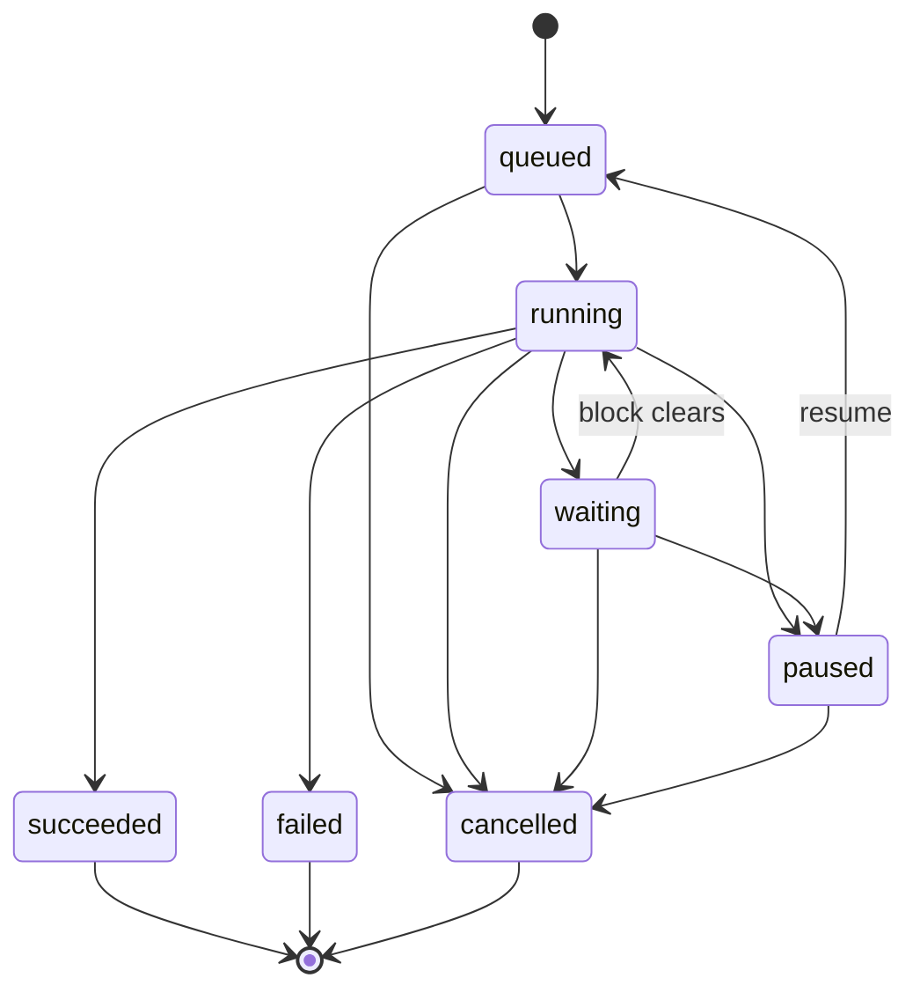

# Task lifecycle

Every plugin run and every AI-chat turn in Vineyard is a **task** in one client-side queue. This page documents the seven task states, the legal transitions between them, how cooperative cancellation works, why retry mints a new task, and where task state actually lives.

## One client-side queue

Tasks execute on the client:

- A **Web Worker pool** with a **concurrency cap** runs tasks in parallel up to the cap; the rest sit `queued`.
- **Multi-tab single-execution** is enforced via the **Web Locks API**, so a task does not run twice when the same project is open in two tabs.
- Both plugin runs and AI-chat turns share this one queue — the Tasks panel shows them together. See the user-facing view in [guide/tasks](../guide/tasks.md).

## The seven states

`TaskState` is defined in `sdk/types.ts` (see the [SDK](sdk.md) reference):

```ts
type TaskState =
  | "queued" | "running" | "waiting"
  | "paused" | "succeeded" | "failed" | "cancelled";
```

| State | Meaning |
| --- | --- |
| `queued` | Accepted, waiting for a free worker slot under the concurrency cap. |
| `running` | Executing in a worker. |
| `waiting` | Blocked on something external; auto-resumes when the block clears. A worker slot **may be released** while waiting. |
| `paused` | Suspended by the user; will re-enter the queue on Resume. |
| `succeeded` | Completed normally. **Terminal.** |
| `failed` | Completed with an error. **Terminal.** |
| `cancelled` | Stopped cooperatively (or by a backstop). **Terminal.** |

## Transition table

```text
queued  → running | cancelled
running → waiting | paused | succeeded | failed | cancelled
waiting → running | paused | cancelled        (auto-resume when the block clears)
paused  → queued  | cancelled
succeeded | failed | cancelled = terminal
```



!!! note "`paused` re-queues; it does not resume directly"
    Resuming a `paused` task sends it back to `queued`, where it must re-acquire a worker slot. A `waiting` task, by contrast, **auto-resumes** straight to `running` when its block clears (subject to the cap).

## `waiting` is generalized

`waiting` is more than HTTP `Retry-After` backoff. The block reason is one of:

| Reason | Trigger |
| --- | --- |
| `rate_limit` | HTTP 429 / `Retry-After`; the single home for backoff is [`ctx.net.fetchWithBackoff()`](sdk.md). |
| `awaiting_user_input` | The run needs more input before it can continue. |
| `external_poll` | Polling an external job/resource until it is ready. |
| `cors_blocked` | A web request was blocked by the browser cross-origin policy. |
| `token_refresh` | A scoped credential is being refreshed. |

Because a slot may be released while a task is `waiting`, a long backoff does not hold the concurrency cap hostage — other queued tasks can run in the meantime. The Tasks panel exposes **Resume-now** and a **countdown** for waiting tasks.

## Cancel is cooperative

Stopping a task is **cooperative**, built on the Web `AbortController` / `AbortSignal` pair:

- The host aborts the controller; the plugin observes `ctx.signal` (an `AbortSignal`) or registers `ctx.onCancel(handler)`.
- A well-behaved plugin checks `ctx.signal.aborted` between units of work and unwinds cleanly, preserving any partial results.

See the [SDK](sdk.md) for an `ctx.signal` checkpoint example.

!!! warning "Never `worker.terminate()` on the user's Stop"
    Hard-killing the worker on a user Stop throws away partial results. The host **does not** call `worker.terminate()` for a normal Stop. It is reserved as a **last-resort timeout backstop** for a worker that refuses to honour the abort signal. Design `run()` to be interruptible — see [SDK](sdk.md) and [lifecycle controls in the manifest](plugin-manifest.md).

## Retry is not a state

There is no `retry` state and no in-place restart. Retrying a terminal task **mints a brand-new task** that records `retry_of: <prevId>`. The original terminal record is left untouched, so its (ephemeral) result and logs remain inspectable. AI turns offer **Reopen** in the same spirit.

Per-state controls in the Tasks panel:

| State | Controls |
| --- | --- |
| `queued` | Cancel |
| `running` | Stop / Pause (+ spinner, progress) |
| `waiting` | Resume-now / Cancel (+ countdown) |
| `paused` | Resume / Cancel |
| `succeeded` / `failed` / `cancelled` | Retry / (AI) Reopen / Save-to-history |

## Ephemeral storage tiers

Task state is **ephemeral by default**. There are three tiers, in order of authority:

=== "Tier 1 — Tab memory"
    The **authoritative** store is the in-tab `zustand` store. Live state, progress, and results live here for the duration of the tab session.

=== "Tier 2 — IndexedDB mirror (optional)"
    An **optional, scrubbed** IndexedDB mirror exists only so state survives an in-tab reload. It is a **cache**: it is never synced anywhere and is not a source of truth.

=== "Tier 3 — Postgres (opt-in only)"
    By default Postgres stores **nothing** about a task. An explicit, user-initiated **Save** writes a single sanitized `TaskSnapshot` row. Nothing is written without that action.

!!! tip "AI chat is stateless streaming"
    With this model, `AIChatView` becomes **stateless streaming** (`POST {messages, model}` → stream). There are no `ChatSession` / `ChatMessage` / per-session `Task` rows unless the user explicitly Saves. Collaborator presence is a live in-memory beacon over the existing project WebSocket (status + subject only, no secrets, never persisted).

## Lifecycle hints in the manifest

A plugin advertises its lifecycle shape in `manifest.lifecycle` so the host can render the right controls before the run even starts:

```json
"lifecycle": {
  "persistence": "ephemeral",
  "controls": ["cancel", "progress"],
  "progress": "determinate"
}
```

Whole-graph mutators such as the Chaos pack's **Thanos Snap** or **Black Hole** typically declare determinate progress and `cancel`, so a user can Stop a bulk delete mid-sweep and keep whatever was already returned. See [plugin manifest](plugin-manifest.md) for the full `Lifecycle` shape and [SDK](sdk.md) for the `ctx.progress` surface.

## Next / See also

- [SDK](sdk.md) — `ctx.signal`, `ctx.progress`, `ctx.net.fetchWithBackoff`
- [Plugin manifest](plugin-manifest.md) — declaring `lifecycle` controls and progress
- [Security model](security.md) — sandbox, run tokens, and task state
- [Architecture](architecture.md) — where the worker pool and HostBridge sit
- [Tasks (user guide)](../guide/tasks.md) — the Tasks panel from a user's point of view
