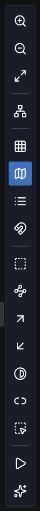
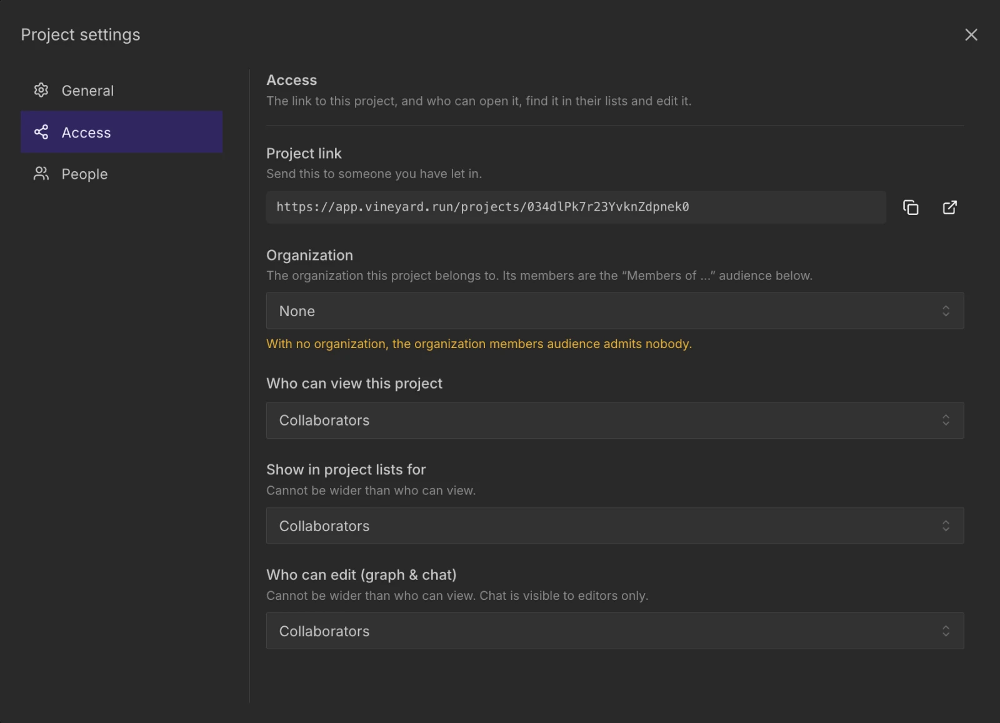
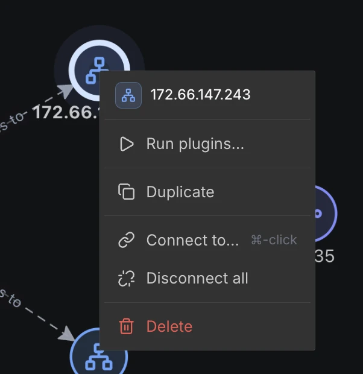
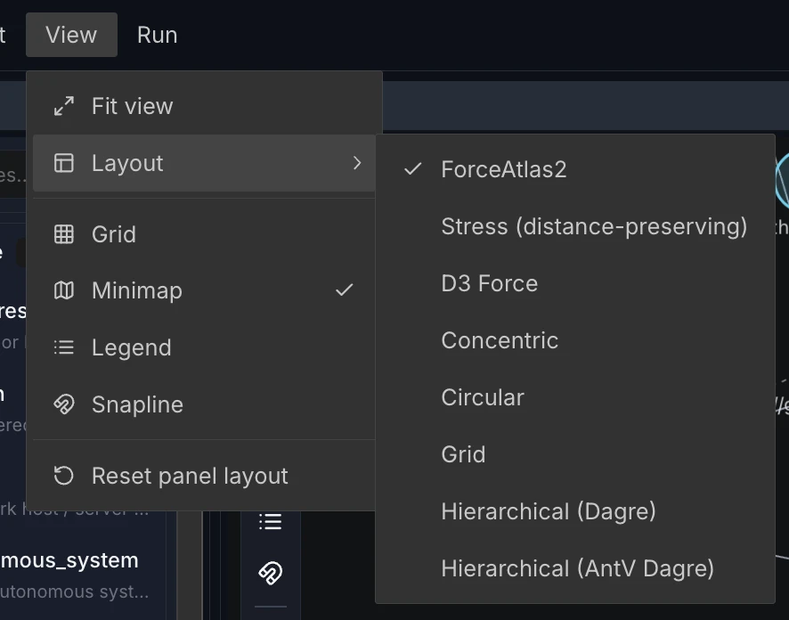
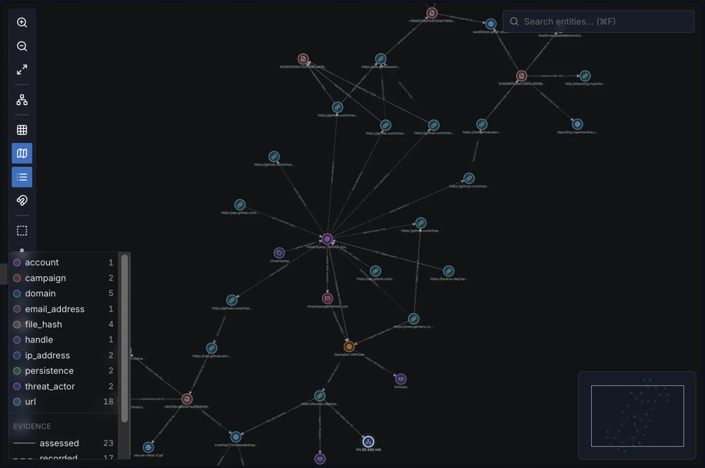

# 캔버스

캔버스는 Vineyard 프로젝트가 존재하는 곳입니다: 팬, 줌, 재배치, 주석이 가능한 그래프 위에 배치된 노드와 엣지. 이 페이지에서는 캔버스 내 툴바와 상단 메뉴 바(**Project / Edit / View / Run**)에서 사용 가능한 모든 컨트롤을 문서화합니다.

## 동일한 작업에 도달하는 두 가지 방법

보기 컨트롤은 두 번 노출되며, 둘은 항상 동기화됩니다:

- **캔버스 내 툴바** — 캔버스 왼쪽 상단 가장자리에 고정된 컴팩트한 세로 막대로, 작업 중 가장 자주 사용하는 컨트롤이 있습니다.
- **상단 메뉴 바** — **Project**, **Edit**, **View** 메뉴로, 보기 토글과 함께 데이터 및 탐색 작업을 추가합니다 (네 번째 메뉴인 **Run**은 플러그인과 AI 에이전트를 실행합니다 — [플러그인 실행하기](running-plugins.md) 참조).

## 보기 컨트롤 (툴바 + View 메뉴)

{ .vy-toolbar align=right width="44" loading=lazy }

툴바 토글 버튼은 켜져 있을 때 강조 표시되고, 메뉴 항목은 켜져 있을 때 체크 표시됩니다.

| 컨트롤 | 동작 | 인터페이스 |
| --- | --- | --- |
| **Zoom in** (확대) | 캔버스를 확대합니다 (1.2×). | 툴바 |
| **Zoom out** (축소) | 캔버스를 축소합니다 (0.8×). | 툴바 |
| **Fit view** (보기 맞춤) | 모든 노드가 보이도록 전체 그래프를 프레임에 맞춥니다. | 툴바, **View** |
| **Layout** | 내장 레이아웃 중 하나를 적용합니다 (아래 참조). 활성 레이아웃에 체크 표시됩니다. | 툴바, **View** |
| **Grid** | 배경 정렬 그리드를 토글합니다. | 툴바, **View** |
| **Minimap** | 미니맵 개요 패널을 토글합니다 (우측 하단). | 툴바, **View** |
| **Legend** (범례) | 노드 유형 범례를 토글합니다 (좌측 하단). | 툴바, **View** |
| **Snapline** | 노드 드래그 시 표시되는 정렬 가이드를 토글합니다. | 툴바, **View** |
| **Reset panel layout** (패널 레이아웃 초기화) | 프로젝트 작업 공간의 패널 배치를 기본값으로 복원합니다. | **View** |

!!! note "Reset panel layout은 그래프가 아닌 패널을 초기화합니다"
    **Reset panel layout**은 주변 작업 공간 패널(캔버스, 사이드 패널 등)을 초기 분할로 복원합니다. 그래프 레이아웃을 다시 실행하거나 노드를 이동하지 **않습니다**. 노드를 재배치하려면 대신 **Layout**을 선택하세요.

## 기타 툴바 버튼

툴바는 보기 컨트롤 아래에 **Edit** 메뉴의 선택 작업(Select all, connected neighbors, outbound, inbound (1 hop), Invert, Select isolated, Clear)을 반복합니다. 마지막에는 **Run plugins**와 **Ask the AI agent**가 있습니다. **Run plugins**의 툴팁은 범위를 알려 줍니다 — "Run plugins on N selected nodes", 아무것도 선택하지 않았으면 전체 프로젝트를 뜻하는 "nothing selected". 노드가 선택된 상태에서 **Ask the AI agent**를 누르면 그 노드에 대한 질문이 미리 채워진 채로 AI 에이전트 패널이 열립니다.

## 상단 메뉴 바

### Project

| 항목 | 동작 |
| --- | --- |
| **Project settings…** (프로젝트 설정) | 프로젝트 설정 대화상자를 엽니다. **General**에는 프로젝트 이름, **Leave**(협업자만), 프로젝트 삭제(소유자만)가 있습니다. **Access**에는 프로젝트 링크, 프로젝트가 속한 조직, 그리고 누가 프로젝트를 보고, 프로젝트 목록에서 보고, 편집할 수 있는지가 있습니다. 이 설정은 프로젝트 소유자나 해당 조직의 소유자/관리자만 바꿀 수 있고, 그 외 사용자에게는 읽기 전용으로 보입니다. **People**에는 소유자와 협업자가 표시됩니다. 프로젝트 소유자나 조직 소유자/관리자가 사용자 이름으로 협업자를 초대하고(**View only** / **Can edit**), 권한을 바꾸고, 내보낼 수 있습니다. 초대받은 사람은 초대를 수락한 뒤에야 접근 권한을 얻으며, 초대는 그 사람의 대시보드와 **Projects** 페이지에 표시됩니다. 수락 전까지는 "Invitation pending"으로 표시되고 초대를 취소할 수 있습니다. 로컬 모드에서는 **General**만 있습니다. |
| **Export graph (JSON)** (그래프 내보내기) | 현재 그래프를 JSON 파일로 다운로드합니다 ([그래프 내보내기](#json-그래프-내보내기) 참조). |
| **Import graph (JSON)…** (그래프 가져오기) | 내보낸 JSON 파일을 프로젝트로 불러오는 대화상자를 엽니다. 노드는 매번 새로 만들어지므로, 같은 파일을 두 번 가져오면 모든 노드가 한 번 더 추가됩니다. |
| **Activity log…** (활동 로그) | 프로젝트의 활동 로그를 엽니다. |
| **Add from Marketplace…** (마켓플레이스에서 추가) | 이 프로젝트에 범위가 지정된 [마켓플레이스](../marketplace.md)를 열어 플러그인과 Type Pack을 추가합니다. |

프로젝트를 공개 링크로만 열었다면 **Activity log…**는 비활성화되고(프로젝트 멤버 전용), **Project settings…**에는 프로젝트 링크만 보입니다.

<figure class="vy-shot" markdown="span">
  { width="800" loading=lazy }
  <figcaption>Project settings → Access: 프로젝트 링크, 소속 조직, 보기·목록 표시·편집 권한.</figcaption>
</figure>

### Edit

| 항목 | 동작 |
| --- | --- |
| **Select all** (전체 선택) | 모든 노드를 선택됨으로 표시합니다. |
| **Select connected neighbors (1 hop)** (연결된 이웃 선택) | 현재 선택의 1홉 이웃을 선택에 추가합니다. |
| **Select outbound 1-hop nodes** (나가는 방향 1홉 노드 선택) | 선택이 가리키는 노드를 추가합니다(선택된 노드에서 나가는 엣지만 따라감). |
| **Select inbound 1-hop nodes** (들어오는 방향 1홉 노드 선택) | 선택을 가리키는 노드를 추가합니다(선택된 노드로 들어오는 엣지만 따라감). |
| **Invert selection** (선택 반전) | 선택되지 않은 모든 노드를 선택하고, 선택된 노드는 선택 해제합니다. |
| **Select isolated nodes** (고립 노드 선택) | 엣지가 없는 모든 노드를 선택합니다. |
| **Clear selection** (선택 해제) | 모든 노드 선택을 해제하고 선택 개수를 초기화합니다. |

세 가지 1홉 작업은 선택에 추가하므로, 다시 누르면 한 홉씩 더 나아갑니다. 아무것도 선택되지 않았으면 비활성화됩니다.

!!! note "노드 추가하기"
    새 노드는 이 메뉴가 아니라 **Types**(유형) 패널에서 활성화된 유형을 선택해 생성합니다.

### Run

| 항목 | 동작 |
| --- | --- |
| **Ask the AI agent…** (AI 에이전트에게 묻기) | AI 에이전트 패널을 새 대화로 엽니다(열려 있던 대화는 **Tasks**에 남습니다). 이전 대화는 **Tasks**에서 해당 행을 클릭해 다시 엽니다. |
| **Run plugins…** (플러그인 실행) | 실행 패널을 엽니다. 노드가 선택되어 있으면 그 선택으로 범위가 지정됩니다. |
| *(Skill packs)* | 프로젝트에 설치된 모든 Skill Pack이 구분선 아래에 나열됩니다. 선택하면 읽기용으로 열리며, 아무것도 실행하지 않습니다 ([Skill Pack](skillpacks.md) 참조). |

## 우클릭 메뉴

- **노드** — **Run plugins…**(이 노드에 대해), **Duplicate**(복제), **Connect to…**([엣지 그리기](#엣지-그리기) 참조), **Disconnect all**(노드에 닿는 모든 엣지 삭제), **Delete**.
- **엣지** — **Reverse direction**(방향 반전), **Delete**.
- **선택** — 무언가 선택된 상태에서 빈 캔버스를 우클릭하거나, 여러 항목 선택에 포함된 노드를 우클릭하면 열립니다. 머리글에 개수가 표시됩니다(*Selected: N nodes, M edges*). **Run plugins…**와 **Connect to…**(노드가 선택된 경우), **Delete (N)**, **Select all**, **Fit view**.
- **빈 캔버스** (선택 없음, 머리글 *Nothing selected — whole project*) — 전체 프로젝트에 대한 **Run plugins…**, **Select all**, **Fit view**.

<figure class="vy-shot" markdown="span">
  { width="301" loading=lazy }
  <figcaption>노드 메뉴.</figcaption>
</figure>

## 레이아웃

레이아웃을 적용하면 노드 위치가 재계산된 후 보기가 맞춰집니다.

<figure class="vy-shot" markdown="span">
  { width="443" loading=lazy }
  <figcaption>View ▸ Layout. 현재 레이아웃에 체크 표시가 붙습니다.</figcaption>
</figure>

| 레이아웃 | 설명 |
| --- | --- |
| **ForceAtlas2** | 노드를 밀어내고 연결된 노드를 끌어당기는 힘 기반 레이아웃(Gephi의 ForceAtlas2). 링크 분석 그래프용으로 만들어졌습니다. 기본값입니다. |
| **Stress (distance-preserving)** | 화면상 거리가 노드 사이의 홉 수를 따르도록 배치합니다. ForceAtlas2보다 클러스터 구분은 약합니다. |
| **D3 Force** | D3 기반 힘 유도 변형. |
| **Concentric** | 노드를 동심원 고리로 배열하며 겹침을 방지합니다. |
| **Circular** | 노드를 단일 원 주위에 균등하게 배치합니다. |
| **Grid** | 노드를 정규 그리드 위에 배치하며 겹침을 방지합니다. |
| **Hierarchical (Dagre)** | 위에서 아래로 계층적 레이아웃, 방향성/트리형 그래프에 적합. |
| **Hierarchical (AntV Dagre)** | AntV 자체의 Dagre 변형 — 역시 위에서 아래로 계층 배치하며, 넓은 그래프에서 대개 더 빠릅니다. |

!!! tip
    낯선 그래프의 시작점으로는 ForceAtlas2가 가장 좋습니다. 어느 클러스터에 속하는지보다 두 개체가 몇 단계 떨어져 있는지가 중요하면 Stress로, 관계가 방향성이고 명확한 계층을 원할 때는 Hierarchical (Dagre)로 전환하세요.

## 오버레이

<figure class="vy-shot" markdown="span">
  { width="800" loading=lazy }
  <figcaption>범례(왼쪽 아래)는 그래프에 있는 유형과 개수, 증거 등급을 보여 주고, 미니맵(오른쪽 아래)은 현재 보이는 영역을 표시합니다.</figcaption>
</figure>

### 검색

캔버스 오른쪽 위의 **Search entities…** 입력란은 유형이나 속성 값으로 노드를 찾습니다. `AS64496`처럼 AS 번호를 입력하면 ASN이 64496인 노드도 찾습니다. **⌘F**(Mac) 또는 **Ctrl+F**로 입력란으로 바로 이동하고, **↑**/**↓**와 **Enter**로 결과를 고르며, **Esc**로 목록을 닫습니다. 결과를 고르면 해당 노드가 선택되고 화면 가운데로 옵니다. 프로젝트를 아직 불러오는 중에는 결과가 비어 있어도 노드가 없다는 뜻이 아니라 아직 도착하지 않았다는 뜻입니다.

### 그리드

팬과 줌에 따라 캔버스를 따라다니는 미묘한 배경 그리드로, 노드 정렬을 위한 시각적 참조를 제공합니다.

### 미니맵

우측 하단 모서리에 도킹된 반투명 개요 패널. 현재 보기를 표시하는 뷰포트 직사각형과 함께 전체 그래프를 축소판으로 보여줍니다 — 대규모 프로젝트에서 방향을 잡는 데 유용합니다.

### 범례

좌측 하단의 반투명 미니맵 스타일 패널로, 그래프에 **현재 존재하는** 노드 유형을 나열합니다. 각 항목은 노드의 유형 색상과 일치하는 색상 견본, 유형의 이름(설치된 팩이 정의하지 않은 유형이면 원래 유형 문자열), 해당 유형의 노드 개수를 **표시**합니다. 항목은 레이블 기준 알파벳 순으로 정렬됩니다. 그래프가 비어 있으면 범례에 "No nodes."라고 표시됩니다.

항목을 클릭하면 해당 유형의 모든 노드가 선택되고, Shift-클릭하면 현재 선택에 추가됩니다. 항목에 마우스를 올리거나 포커스하면 캔버스에서 다른 유형이 모두 흐려집니다.

유형 아래의 **Evidence** 키는 프로젝트에 있는 엣지 신뢰도 등급(assessed, asserted, recorded, circumstantial, contested, unassessed)을 강한 순서대로 나열하며, 각 등급을 캔버스가 그 등급에 쓰는 것과 같은 선 스타일(대시, 두께, 불투명도)과 개수로 표시합니다. 등급에 마우스를 올리면 의미가 표시됩니다.

범례는 프로젝트가 사용하는 Type Pack을 반영합니다 — 예를 들어, [Infrastructure Type Pack](typepacks.md)으로 구축된 조사는 `infrastructure.ip_address`, `infrastructure.domain` 등의 개수를 표시하며, 각각 Type Pack에서 정의된 이름과 색상으로 해석됩니다.

### 스냅라인

활성화된 경우, 노드를 다른 노드의 가장자리나 중심 근처로 드래그하면 정렬 가이드(수직 및 수평선)가 표시되고 노드가 정렬 위치에 스냅됩니다. 그리드, 미니맵, 범례와 달리 스냅라인은 지속적 패널이 없습니다 — 활발히 드래그하는 동안에만 나타납니다.

### 병렬 엣지

같은 두 노드를 연결하는 엣지가 둘 이상이면 — 방향에 관계없이 — 캔버스는 서로 겹쳐
그리는 대신 호(arc) 모양으로 벌려서 각 엣지가 보이고 개별적으로 클릭 가능하도록
합니다.

## 엣지 그리기 {#엣지-그리기}

연결을 시작할 노드를 선택한 다음, 연결할 대상 노드를 **⌘-클릭**(Mac) 또는 **Ctrl-클릭**(Windows/Linux)합니다. 클릭한 자리에 작은 상자가 열리면 관계(자유 텍스트, 예: `resolves to`)를 입력하고 **Enter**를 누릅니다. 선택된 모든 노드에서 클릭한 노드로 엣지가 하나씩 생성됩니다. 클릭할 때 **Shift**를 누르고 있거나 상자의 **Reverse**를 누르면 반대 방향(클릭한 노드 → 선택)으로 연결합니다. 노드나 선택을 우클릭해 **Connect to…**를 고른 뒤 대상을 그냥 클릭해도 됩니다. **Esc**는 어느 단계에서든 취소하며, Enter를 누르기 전에는 아무것도 기록되지 않습니다. 엣지는 순서가 있는 노드 쌍마다 하나뿐이므로, 이미 연결된 쌍은 건너뛰고 "already connected"로 집계합니다. 반대 방향은 별개의 엣지입니다. 아무것도 선택하지 않았으면 클릭해도 먼저 노드를 선택하라는 안내만 표시됩니다.

<figure class="vy-shot">
  <video src="../../../assets/guide/draw-edge.mp4" poster="../../../assets/guide/draw-edge.webp" width="960" height="638" muted loop playsinline controls preload="none" aria-label="IP 하나를 클릭하고 다른 하나를 Shift-클릭한 뒤 AS 노드를 ⌘-클릭, 관계를 입력하고 Enter: 선택한 노드마다 엣지가 하나씩 생깁니다."></video>
  <figcaption>IP 하나를 클릭하고 다른 하나를 Shift-클릭한 뒤 AS 노드를 ⌘-클릭, 관계를 입력하고 Enter: 선택한 노드마다 엣지가 하나씩 생깁니다.</figcaption>
</figure>

## JSON 그래프 내보내기 {#json-그래프-내보내기}

`Project ▸ Export graph (JSON)`은 프로젝트의 현재 노드와 엣지를 프로젝트 이름을 딴 JSON 파일로 다운로드합니다. 내보내기는 그래프 데이터의 스냅샷을 캡처합니다:

```json
{
  "project": "my-investigation",
  "exported_at": "2026-06-28T12:00:00.000Z",
  "nodes": [ /* … */ ],
  "edges": [ /* … */ ]
}
```

프로젝트를 아직 불러오는 중이면(예: 재연결 후 다시 동기화하는 동안) 내보내기가 거부되고 *The project is still loading — export again once it has finished.*라는 알림이 표시됩니다. 내보내기에 성공하면 알림에 기록된 노드와 엣지 개수가 표시됩니다.

## 마켓플레이스에서 추가

`Project ▸ Add from Marketplace…`는 현재 프로젝트에 범위가 지정된 [마켓플레이스](../marketplace.md)를 열어, 프로젝트에 직접 연결된 플러그인과 Type Pack을 추가할 수 있습니다. 전체 흐름은 [설치하기](installing.md)를 참조하세요.

## 다음 / 함께 보기

- [플러그인 실행하기](running-plugins.md) — 캔버스의 노드에 대해 플러그인을 실행합니다.
- [Type Pack](typepacks.md) — 노드 유형, 색상, 레이블이 범례를 구동하는 방식.
- [작업](tasks.md) — 장기 실행 플러그인 실행을 추적합니다.
- [마켓플레이스 둘러보기](../marketplace.md) — 추가할 팩을 찾습니다.
