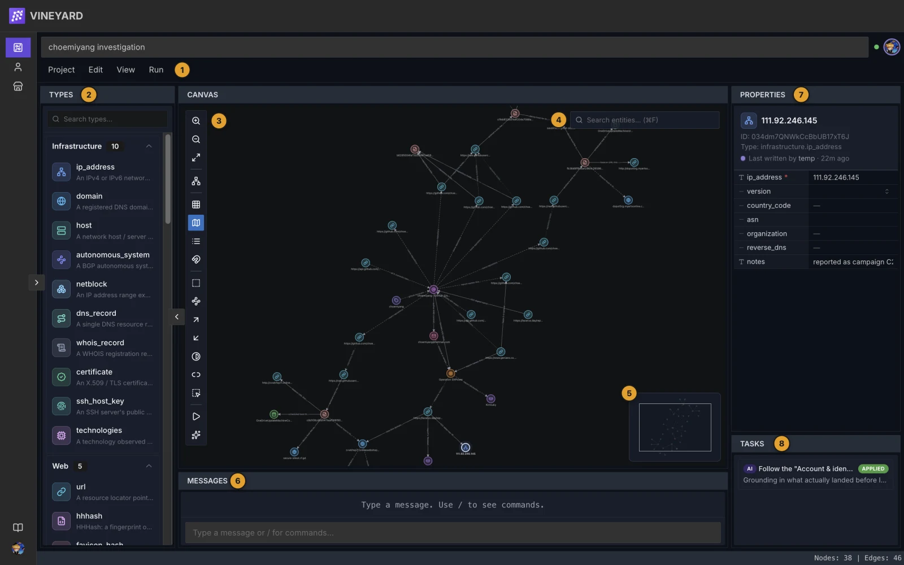

# Getting started

A first-run walkthrough: open the Vineyard app, create a project, install a **Type Pack** and a **plugin** from the Marketplace, then run that plugin against your graph.

## 1. Open the app

Vineyard runs in your browser, or as the Vineyard desktop app. Sign in, and you land on your dashboard (reopening the app while still signed in goes to the last project you opened instead, if you chose that under **Settings → General → Start view**). The desktop app can also run in local mode with no account; it opens on the dashboard as well.

The dashboard is your home page. **Continue** lists the project you opened last and your most recently active ones, **Since your last visit** shows what others changed in your projects while you were away, and **Activity** follows changes across all your projects. Signed in to a server, a search box above them finds entities across your projects.

Plugins and Type Packs **execute on the client**: the server stores your graph and brokers collaboration, but it never runs plugin code.

!!! tip "Announcements"
    Signed in to a server, the right side of the top bar rotates the service's pinned announcements, one title at a time (hover to hold one). Click a title to read it; **All announcements** there lists every announcement. Local mode has no server and shows none.

## 2. Open or create a project

A **project** owns a graph (nodes + edges), its collaborators, and its installed set of packs.

- **Existing project:** pick it from the list.
- **New project:** choose **New project** on the Projects page or the dashboard, give it a name and optionally an organization, click **Create project**, and you're dropped straight onto its canvas.

An organization shares projects with a team: its page under **Organizations** lists its members and their roles and the projects attached to it, and its owners and admins invite members there.

!!! note "Installs belong to the project"
    Packs are installed **onto a project**, not your account, so every collaborator on that project gets the same vocabulary and tools. Only the project owner can change the installed set.

## 3. Meet the canvas

The canvas is your working surface — a node/edge graph you can pan, zoom, and lay out. For the full tour of menus, context menus, and side panels, see [The canvas](canvas.md).

<figure class="vy-shot" markdown="span">
  { width="800" loading=lazy }
  <figcaption>The project workspace: 1 menu bar, 2 Types, 3 canvas toolbar, 4 entity search, 5 minimap, 6 Messages, 7 Properties, 8 Tasks.</figcaption>
</figure>

A brand-new project has **no entity types** yet. That's what a Type Pack fixes.

## 4. Open the Marketplace

From the canvas, choose **Project → Add from Marketplace…**. Search by name/author/description, filter by type and verified status, sort by name, author, or kind, then open a card for details. See [Browse & install](installing.md) for the full tour.

## 5. Add a Type Pack (entity types)

A **Type Pack** is pure JSON that defines the **entity types** (and optional edge types) your nodes can be. Install one before plugins, because a plugin's inputs and outputs are expressed in terms of Type Pack types.

In the Marketplace, switch to Type Packs and install **Infrastructure** (`run.vineyard.typepacks.infrastructure`). It ships entity types such as `infrastructure.ip_address`, `infrastructure.netblock`, and `infrastructure.domain`. More in [Type Packs](typepacks.md).

## 6. Install a plugin

A **plugin** is JavaScript that reads and/or writes your graph, asking your approval for the permissions it needs. One good first install covers both scopes a run can have:

- **Chaos Reference Pack** — one bundle with six small, pure-compute, no-network plugins for learning the run loop on a throwaway graph. Two of them show the two scopes a run can have: **Black Hole** acts on the node you have selected (right-click it → **Run plugins…**), and **Korean Roulette** acts on the whole graph (**Run ▸ Run plugins…**).

When you install, an **approval dialog** lists the plugin's permissions in plain language so you can see what it can touch before you grant it. Full details in [Browse & install](installing.md).

## 7. Run it

Every plugin launches from the same **Run plugins** panel; what it **consumes** decides when it is listed:

- **Right-click a node → Run plugins…** opens the Run plugins panel scoped to your selection. It lists the plugins that consume the selected node types, plus plugins that take no node type (such as Black Hole, which acts on the selected node).
- **Run ▸ Run plugins…** with nothing selected (or right-clicking empty canvas) opens the same panel on the whole project. Use it for whole-graph plugins such as Korean Roulette.

Tick the plugins you want. If a plugin takes input, its fields appear under it in the panel; fill in the required ones. Then press **Run**. The node you right-clicked is the run's target, not a form value.

Watch it in the **Tasks** panel. A task starts `running`, with a **Stop** control while it runs, and ends `succeeded`, `failed`, or `cancelled`. A run never edits the graph directly: when it stages changes, its badge shows **needs review** instead of `succeeded`. Click it to open the Review dialog, check the changes, and press **Apply** (or **Discard all**); the badge then reads **applied** (or **discarded**). For Black Hole, the target node's 1-hop neighbours disappear from the canvas when you apply.

<figure class="vy-shot">
  <video src="../../assets/guide/run-plugin.mp4" poster="../../assets/guide/run-plugin.webp" width="1280" height="800" muted loop playsinline controls preload="none" aria-label="Example: right-click example.com, choose Run plugins…, tick DNS Lookup (A Record) and press Run; then click needs review in Tasks and press Apply. Two IP address nodes join the graph. Black Hole follows the same steps."></video>
  <figcaption>Example: right-click example.com, choose Run plugins…, tick DNS Lookup (A Record) and press Run; then click needs review in Tasks and press Apply. Two IP address nodes join the graph. Black Hole follows the same steps.</figcaption>
</figure>

## 8. Runs are ephemeral

Nothing about a run is written to the server by the run itself. Its changes reach your graph only when you approve them with **Apply** in the run's review; **Discard all** throws them away. See [Tasks & runs](tasks.md) for details.

## Next / See also

- [Browse & install](installing.md) — search, filter, install, and scope approval
- [Running plugins](running-plugins.md) — launch paths and the Tasks panel
- [Type Packs](typepacks.md) — what entity types do and how to manage them
