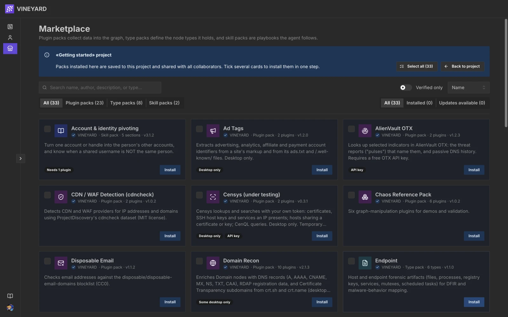
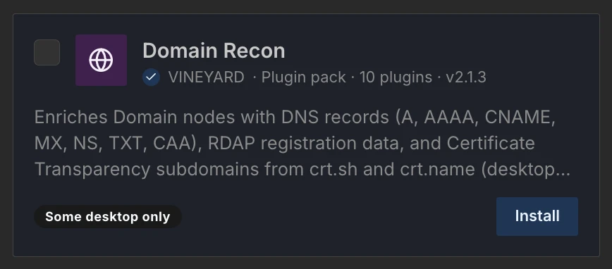
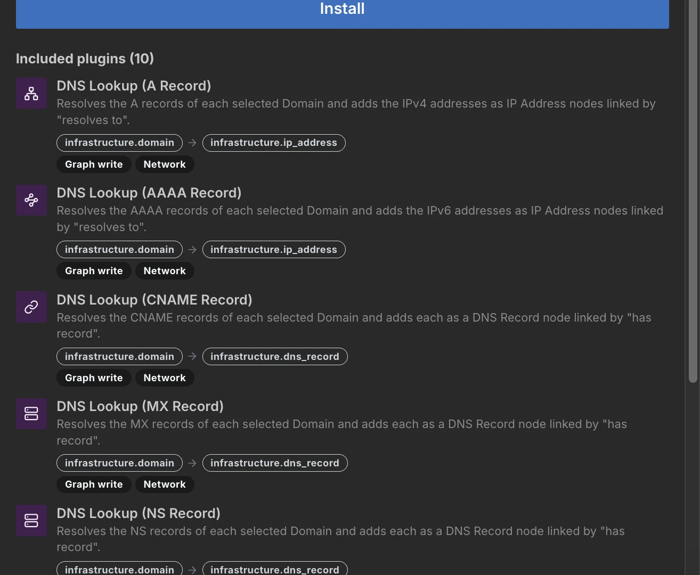
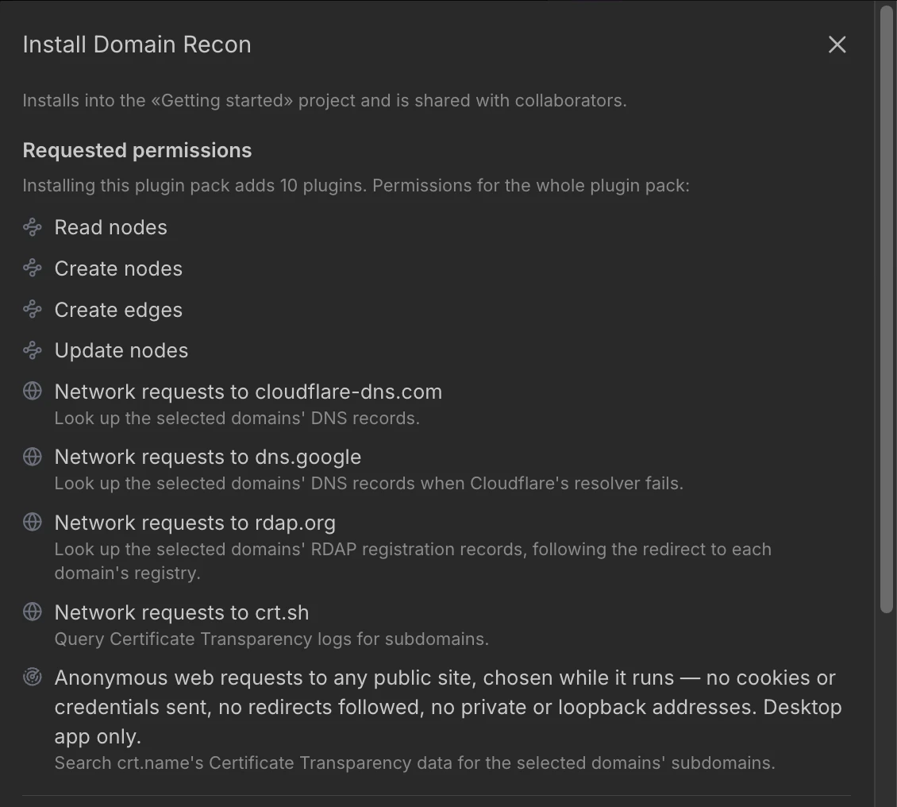

# Browse & install

## Browsing the marketplace

The marketplace is a static catalog: all search, filtering, and sorting happen in your browser.
There is no account, no server query, and no telemetry.

You can browse from two places. Both show the same catalog, but their filters aren't identical:

- **The [Marketplace page](../marketplace.md) on this site** — the public, read-only browser.
- **The in-app mirror** inside the Vineyard app — where **Install** works directly.

<figure class="vy-shot" markdown="span">
  { width="800" loading=lazy }
  <figcaption>The marketplace opened from a project: the kind toggle, the Installed / Updates available switch, and Install on every card.</figcaption>
</figure>

### Searching and filtering

The search box matches an entry's **name**, **author**, **description**, and **identifier**, and
filters the grid live as you type. It also matches a Type Pack's categories; in the app it matches
the Type Packs a Plugin Pack uses and the node types a Skill Pack applies to as well. On this
site's browser, three facets narrow it further, and they combine:

| Facet | What it does |
|---|---|
| **Type** | A segmented toggle: **All**, **Plugin packs**, **Type packs**, or **Skill packs**. |
| **Category** | A dropdown of Type Pack categories (e.g. `infrastructure`, `threat`), shown when the catalog has any. Since only Type Packs have categories, picking one leaves only Type Packs in the grid. |
| **Verified only** | A checkbox that hides every entry whose author is not on the verified list. |

A **Sort** dropdown reorders the visible cards: **Name A→Z**, **Name Z→A**, **Verified first**, or
**Group by type**.

The in-app browser has a lighter filter set: the same Type toggle and a **Verified only** switch, but
no category facet, and it sorts by **Name**, **Author**, or **Kind** instead. Inside a project, a
second toggle narrows the grid to **All**, **Installed**, or **Updates available**.

### Reading a card

Each card is a compact summary: an **icon** and **name**, a meta line, a one-line
**description**, and chips in the footer. The meta line reads *author · kind · count · version*,
for example *VINEYARD · Plugin pack · 4 plugins · v1.2.0*, with a verified tick ✓ before the author
when verified. The count is the plugins a Plugin Pack bundles (when more than one), the types a
Type Pack defines, or the sections a Skill Pack holds. The chips name only what a pack asks of you:

- For a **Plugin Pack**: `Desktop only` or `Some desktop only` when all or some of its plugins run
  only in the desktop app, `API key` when it asks for one, and `Vineyard service` when it calls a
  Vineyard-operated service.
- For a **Skill Pack**: `Needs N plugins` for the Plugin Packs it requires. The node types it
  applies to are listed in the detail view.
- A **Type Pack** has no chips.

The full permission list is in the detail view, not on the card.

<figure class="vy-shot" markdown="span">
  { width="434" loading=lazy }
  <figcaption>A Plugin Pack card: the meta line (author · kind · count · version) under the name, and a Some desktop only chip.</figcaption>
</figure>

### The detail view

Clicking a card opens a detail drawer. For a Plugin Pack, a **Permissions** panel restates what
the whole pack requests in plain language — for example *"Delete nodes"* or *"Network requests to
rdap.org"* in the app, and *"Network: calls rdap.org."* on this site. Read this before installing.
The drawer also lists the plugins the pack includes, and shows the pack's **identifier** (e.g.
`run.vineyard.pluginpacks.ip_recon`), **version**, **license**, and repository. In the app, the
Type Packs a Plugin Pack needs are installed with it.

<figure class="vy-shot" markdown="span">
  { width="657" loading=lazy }
  <figcaption>The detail drawer lists each plugin with the types it takes and adds, and what it is allowed to do.</figcaption>
</figure>

!!! note "What "verified" means"
    The verified ✓ attests to the *author's identity* — it is set by the registry, not by the
    author. It says nothing about the safety or quality of a particular pack: always review the
    permissions yourself before installing.

## Installing

Open the marketplace from a project (**Project → Add from Marketplace…**), click **Install** on a
card, and Vineyard takes care of the rest. Opened outside a project, the marketplace is browse-only
and shows no **Install**. When **Install** is disabled, hover it for the reason — for example
*Only the project owner can install*. There is no offline copy of a pack: Vineyard loads it from the
author's repository at the pinned commit each time a project opens, and a plugin's code each time
it runs.

For a **plugin**, an **approval dialog** then lists the permissions it requests in plain
language. Approve, and the plugin becomes available to run in the project.

<figure class="vy-shot" markdown="span">
  { width="565" loading=lazy }
  <figcaption>The approval dialog for Domain Recon: one line per permission, with the reason the pack gives under each network permission.</figcaption>
</figure>

A **Type Pack** or **Skill Pack** carries no permissions, but it goes through the same install
dialog: it shows what will be added (the Type Pack's type count, or the Skill Pack's overview, plus any
packs it pulls in) and installs when you press **Install**.

!!! tip "Packs install their dependencies automatically"
    A plugin whose inputs/outputs reference a Type Pack's types needs that Type Pack installed
    first — the marketplace resolves this for you: installing a Plugin Pack also installs every
    Type Pack its plugins `consume`/`produce`, and installing a Skill Pack pulls in the Plugin
    Packs it requires **and their Type Packs**. Already-installed packs are skipped; a dependency
    that is not in the catalog blocks the install.

## Installing into a project

Installs belong to a **project**, not your account — every collaborator on the project gets the
same vocabulary and tools. Only the project owner can change the installed set.

To add several packs at once, tick their cards (or **Select all**) and choose **Install N
selected**; one dialog shows everything that will be added. Installs are pinned to the version you
installed. When the catalog has a newer one, the card shows **Update** and the detail drawer
**Update available**. Either opens the same approval dialog as an install: permissions the new
version adds are marked **New**, and packs it now needs are listed under **Also installs**. Nothing
changes until you confirm. To uninstall, open the pack and click **Installed — click to remove**;
if nodes in the project still use a Type Pack's types, you are shown how many first and can
**Remove anyway**. A pack the registry has retired is badged **Deprecated** (still installable;
hover the badge for the reason) or **Withdrawn** (cannot be installed, and listed only in a project
that has it, so you can remove it).

## Next / See also

- [Running plugins](running-plugins.md) — what happens after activation
- [Type Packs](typepacks.md) — activating type schemas
- [Skill Packs](skillpacks.md) — using investigation playbooks
- [Tasks](tasks.md) — why runs are ephemeral
