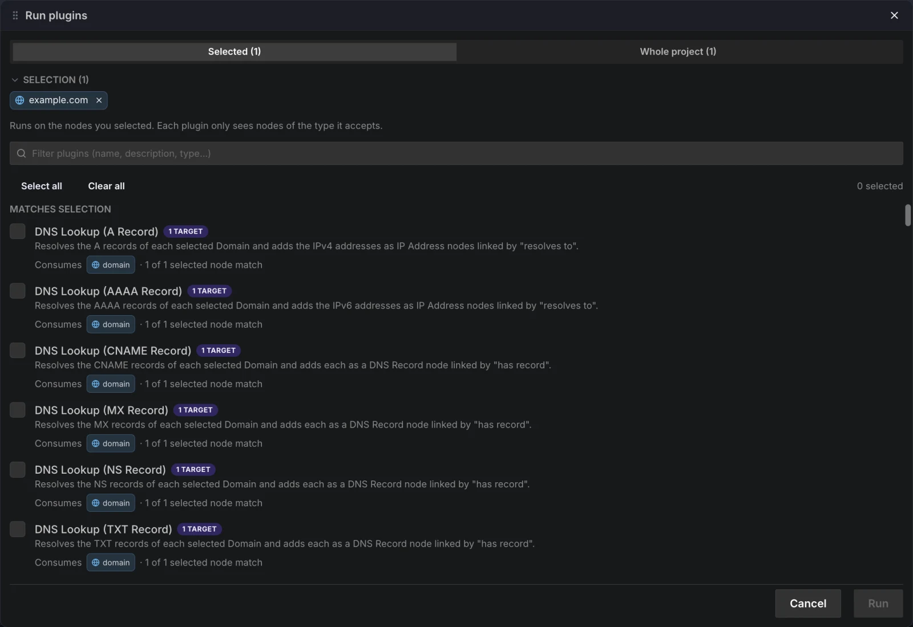
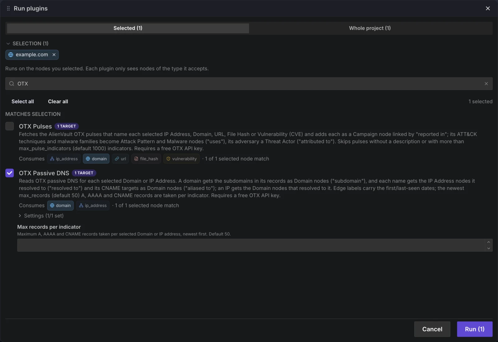
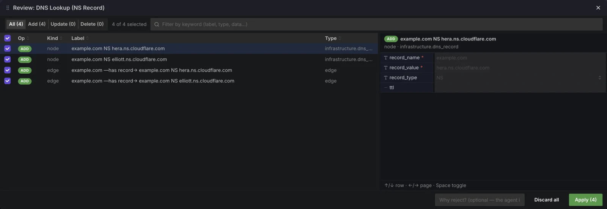

# 플러그인 실행하기

플러그인이 프로젝트에 설치되면 노드·선택 영역·빈 캔버스의 우클릭, 캔버스 도구 모음의 ▶ 버튼,
또는 상단 메뉴 바의 **Run ▸ Run plugins…**에서 **Run plugins** 패널을 엽니다. **Tasks**(작업) 패널에서
실행을 감시하고 취소할 수 있습니다.

## 플러그인이 어디에 표시되는가

설치된 모든 플러그인은 하나의 패널, **Run plugins**에 나열됩니다. 맨 위의 범위 전환에서
**Selected (N)** — 선택된 노드만, 각 플러그인은 자신이 받는 유형의 노드만 봄 — 또는
**Whole project (N)** — 일괄: 프로젝트에서 각 플러그인 입력 유형의 모든 노드 — 를 고릅니다.
모든 플러그인은 입력(`consumes`)을 선언하며, 그 선언이 어느 그룹에 표시될지를 결정합니다:

- **Matches selection** / **Matches project data** → `consumes` 유형이 범위 안에 있는
  플러그인으로, "N targets" 배지가 붙습니다.
- **Whole-graph / input via form** → 아무것도 소비하지 않는 플러그인 (예: Chaos 팩). 이들도
  현재 선택을 받으므로, Black Hole 같은 플러그인은 먼저 노드를 선택하세요.
- **Not applicable here** → 설치되어 있지만 입력 유형이 하나도 범위 안에 없음 (회색 표시).
- **Desktop only** → 설치되어 있지만 브라우저에서는 실행할 수 없음.

여러 플러그인을 체크하고 **Run (N)**을 누를 수 있습니다. 플러그인이 6개를 넘으면 이름, 설명,
유형을 검색하는 필터 상자가 나타납니다. 선택 칩은 ×로 이번 실행에서만 뺄 수 있으며, 캔버스
선택은 그대로 유지됩니다.

<figure class="vy-shot" markdown="span">
  { width="800" loading=lazy }
  <figcaption>example.com을 우클릭해 연 Run plugins 패널: 범위 전환, 선택 칩, 선택과 맞는 플러그인.</figcaption>
</figure>

## 실행 인터페이스

=== "노드 우클릭"

    노드, 선택 영역, 또는 빈 캔버스를 우클릭하고 **Run plugins…**를 고릅니다. 패널은 그
    노드/선택 영역을 범위로, 빈 캔버스에서는 프로젝트 전체를 범위로 열립니다.

=== "Run 메뉴"

    상단 메뉴 바의 **Run** 메뉴 — `Run ▸ Run plugins…` — 는 같은 패널을 현재 선택을
    범위로, 아무것도 선택하지 않았다면 프로젝트 전체를 범위로 엽니다. 캔버스 도구 모음의 ▶
    버튼도 같으며, 툴팁이 범위를 알려 줍니다.

## 실행 전 양식

입력을 받는 플러그인을 체크하면 **Run plugins** 패널에서 그 아래에 필드가 나타납니다 — 텍스트,
숫자, 스위치, 드롭다운, 또는 파일 드롭 영역. 필수 필드는 *로 표시되며, 채울 때까지 **Run**은
비활성 상태로 남습니다. 플러그인이 실행될 노드는 이 필드가 아니라 패널의 범위에서 옵니다.
파일 입력은 파일당 최대 25 MB, 실행당 50개 파일과 250 MB까지 받습니다.

저장된 설정(예: API 키나 게이트웨이 URL)이 필요한 플러그인에는 접을 수 있는
**Settings (x/y set)** 블록이 표시됩니다. 이 값은 입력하는 대로 저장되어 이후 실행에서도
재사용됩니다. 이 기기에서 계정별로 따로 보관되며, 브라우저에서는 이번 세션 동안만, 데스크탑
앱에서는 암호화되어 다시 실행해도 유지됩니다. 이는 Vineyard 안에서 계정을 분리하는 것이지, 이
컴퓨터를 직접 쓸 수 있는 사람으로부터 보호하는 것은 아닙니다. **Run (N)**을 누르면 체크한
모든 플러그인이 시작됩니다.

<figure class="vy-shot" markdown="span">
  { width="800" loading=lazy }
  <figcaption>OTX Passive DNS를 체크하면 입력 필드와 접힌 Settings (1/1 set) 블록이 나타납니다.</figcaption>
</figure>

## 실행 변경 사항 검토

플러그인은 프로젝트에 직접 쓰지 않습니다. 추가·변경·삭제하려는 내용은 스테이징되며, 실행이
끝나면 토스트("N change(s) staged — review to apply")와 **Tasks** 행의 **needs review** 배지가
표시됩니다. 행을 클릭해 **Review**(검토) 대화상자를 열고, 원하지 않는 항목의 체크를 해제한 뒤
**Apply (N)**을 누르거나 — **Discard all**을 누르세요. 적용하기 전에는 프로젝트에 아무것도
기록되지 않으며, **Review** 대화상자가 열려 있는 동안 변경 사항은 캔버스에 미리보기로만 표시됩니다.
아무것도 스테이징하지 않은 실행은 요약(없으면 "No changes")을 보여 주는 토스트로 끝납니다.

<figure class="vy-shot" markdown="span">
  { width="800" loading=lazy }
  <figcaption>실행 하나의 Review 대화상자: 스테이징된 노드와 엣지, 선택한 행의 속성, Apply (4) / Discard all.</figcaption>
</figure>

## 진행률 및 취소

모든 실행은 **작업**이 되어 **Tasks** 패널에 표시됩니다 — 실시간 상태 배지, 플러그인이
보고하는 경우 진행률 막대, 그리고 **Stop**(중지) 컨트롤이 있습니다. **Stop**은 플러그인에 종료를 요청하며, 약 3초 안에 끝나지
않으면 강제 종료됩니다. 이미 스테이징된 변경 사항은 버려지지 않고 검토할 수 있도록
유지됩니다. 시간 예산(기본 10분, 최대 60분)을 넘긴 실행은 중지되고 실패로 표시됩니다. 상태와
컨트롤에 대해서는 [작업 및 실행](tasks.md)을 참조하세요.

## Chaos 레퍼런스 팩

Chaos 팩은 실행 루프를 배우기 위해 그래프를 재구성하는 여섯 개의 작은 플러그인을 담은
단일 번들(`run.vineyard.pluginpacks.chaos`)입니다:

| 플러그인 | 하는 일 |
|---|---|
| Korean Roulette | 임의의 노드 하나를 유지하고 나머지 모두 삭제 |
| Russian Roulette | 임의의 노드 하나 삭제 |
| Thanos Snap | 노드의 절반을 무작위로 삭제 |
| Black Hole | 선택된 노드의 1-홉 이웃 삭제 |
| Dumb AI Optimizer | 몇 초간 가짜 진행 표시, 아무것도 변경하지 않음 |
| Schrödinger's Node | 임의의 노드 선택; 50% 삭제 / 50% 아무것도 안 함 |

!!! tip "안전하게 시도하세요"
    Chaos 팩은 의도적으로 파괴적입니다. 실제 작업을 잃지 않도록 폐기용 그래프에서
    실행하여 Korean Roulette, Thanos Snap, Black Hole이 캔버스를 재구성하는 것을
    지켜보세요.

## 다음 / 함께 보기

- [작업 및 실행](tasks.md) — 작업 상태, 진행률, 중지, 검토
- [둘러보기 및 설치](installing.md) — 플러그인을 프로젝트에 가져오기
- [Type Pack](typepacks.md) — 플러그인이 작용하는 노드 유형
