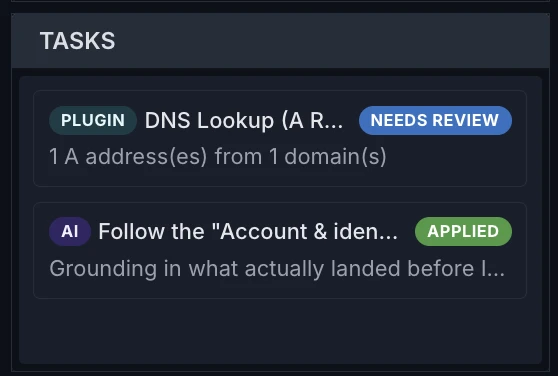
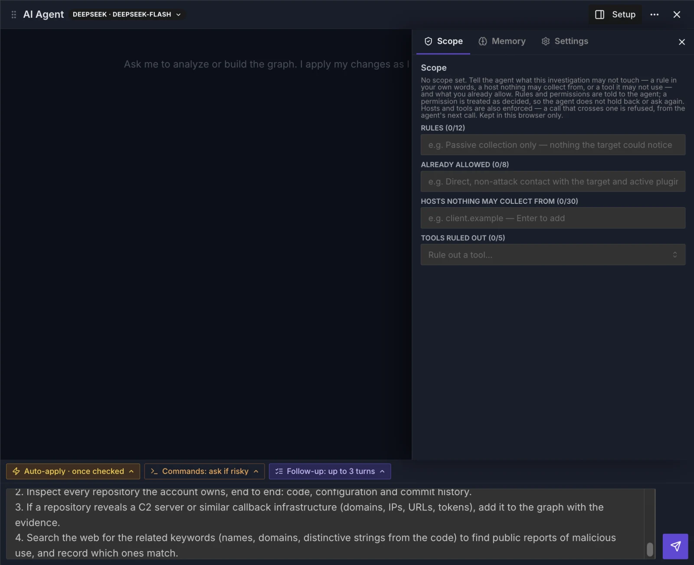
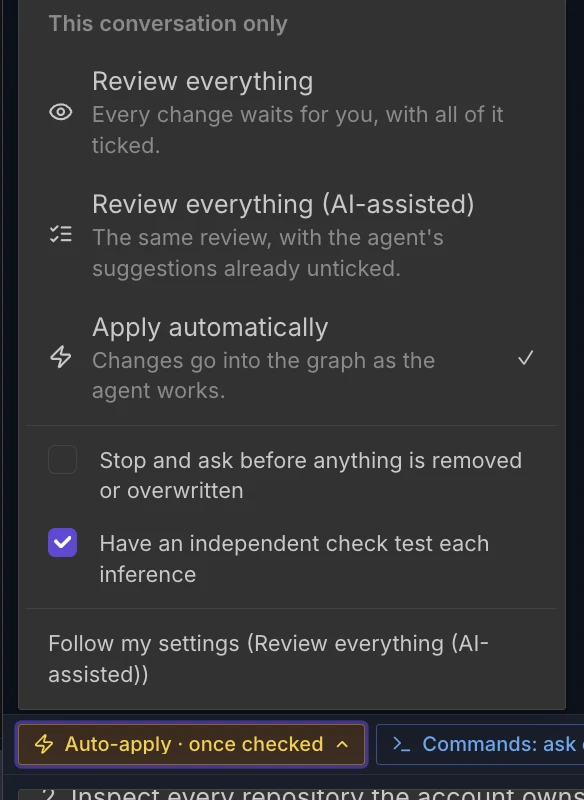
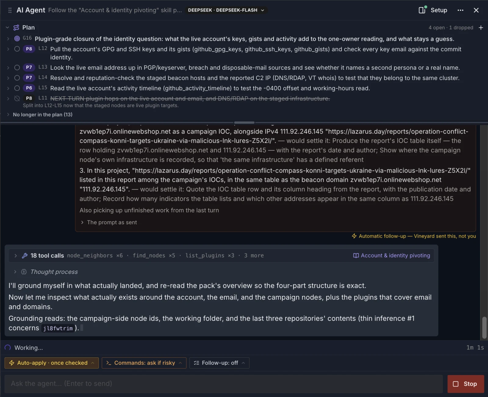

# Tasks & runs

Every plugin run you start, and every AI agent conversation, is a **task** shown in the Tasks panel (one row per conversation; each new turn updates it).

## How tasks work

A running task shows a **running** badge and, when the plugin reports it, a progress bar.

## Task states

| State | What it means |
| --- | --- |
| `running` | Actively executing. |
| `succeeded` | Finished successfully (terminal). |
| `failed` | Ended with an error (terminal). |
| `cancelled` | You stopped it before it finished (terminal). |
| `incomplete` | AI agent only — the turn ended before the agent finished (terminal): it was left with tool calls that never got an answer, or, when you reopen the project, it had run out of steps or was cut off by the app closing. What it did is kept; open the conversation and press **Continue**. |

A turn that runs out of steps keeps its `succeeded` badge until the project is reopened, but the conversation says it stopped at its step limit and offers **Continue**.

A running plugin task has a **Stop** button (stop an AI turn from the AI agent panel). Click a row to open it: an AI task reopens its conversation, a plugin task opens its review. After a run with changes, the badge shows the review state instead — **needs review** (or **N to review**), **applied**, or **discarded** — and an AI task with pending changes also has a **Review staged changes** button.

<figure class="vy-shot" markdown="span">
  { width="279" loading=lazy }
  <figcaption>A plugin run waiting for review, and an AI conversation whose changes were applied.</figcaption>
</figure>

!!! note "Stop is cooperative"
    **Stop** asks the plugin to wind down cleanly. If it has not returned within about 3 seconds, it is force-stopped. Either way, the changes it had already staged are kept and offered for review. A run that exceeds its time budget (10 minutes by default, at most 60) is stopped and marked failed.

## Ephemeral by default

Plugin-run tasks live only in your browser tab's memory; close the tab and they are gone. AI conversations are saved on this device (per project) and come back as Tasks rows after a reload, so you can reopen them. Conversations are saved as they happen, so a turn cut short by closing the app is kept and can be continued. Staged changes that were still waiting for review do not survive a reload. Neither task rows nor conversation content are sent to the Vineyard server; only applied changes are written to the project — the ones you apply in a review, and the ones the agent applies under **Apply automatically**.

!!! tip "AI conversations stay on this device, under your account"
    Conversations, messages, project memory, the project's scope and the agent's plan are kept on this device only and are never written to the server. Like your AI provider and web-search keys, they are kept separately for each account — this separates accounts inside Vineyard, not from someone with direct access to this computer. Set the AI provider, model and key in the AI agent panel under **Setup → Settings**; the web-search key is under **Settings → AI agent**.

## The AI agent panel

The AI agent panel's header shows **AI Agent**, the conversation's title and its model (click the model to change it), then **Setup**, **⋯** and **Close**. **Setup** opens a drawer with three tabs: **Scope** (this project's rules for the agent, what you have already allowed, and hosts and tools it must not use), **Memory** (the project memory) and **Settings** (provider, model and key). **⋯** holds **Export this conversation as HTML**, **Open the agent's working folder** (desktop app only) and **Delete conversation…**. The exported page reads on its own; its **Save as JSON** button saves the same record as JSON.

<figure class="vy-shot" markdown="span">
  { width="800" loading=lazy }
  <figcaption>The AI agent panel with Setup open on Scope. The chips above the message box show the apply mode, commands and follow-up turns for the next message.</figcaption>
</figure>

A row of chips above the message box shows what your next message will run under. The apply and **Commands** chips open a menu that applies to this conversation only, with **Follow my settings** to return to your account settings; **Follow-up** applies to your next message only:

- The first chip says who applies the agent's changes: **Review everything**, **Review everything (AI-assisted)** (the same review, with the agent's suggestions already unticked) or **Apply automatically**. It turns amber while changes land without review. The menu also holds **Stop and ask before anything is removed or overwritten** and **Have an independent check test each inference**.
- **Commands** (desktop app only) — whether the agent may run commands on this machine: **Do not run commands**, **Ask every time**, **Ask only for risky commands** or **Never ask**. The chip is red while commands run without asking.
- **Follow-up** — switch on **Keep working after this turn, on its own** and the agent carries on for up to the number of turns you set, without asking. It needs **Apply automatically**, and it switches off again after the message you send.

<figure class="vy-shot" markdown="span">
  { width="292" loading=lazy }
  <figcaption>The first chip's menu, here set to Apply automatically with the independent check on.</figcaption>
</figure>

Other things to know:

- While changes wait for review you cannot send. The line above the message box says *N change(s) across M change sets need review*, with **Review** and **Discard all**.
- When the agent works from a plan, a **Plan** strip sits above the conversation. Add a lead, raise or lower a lead's priority, or drop it; the agent is told at its next plan update, or when the next turn starts.
- A turn with several tool calls is folded into one line. It counts the calls, names the skill pack the agent read behind a book icon (the first by name, **+N** for more), and flags notes, errors and staged changes; click it to unfold.
- An image in an answer is shown as its description and address, and is never loaded.

<figure class="vy-shot" markdown="span">
  { width="800" loading=lazy }
  <figcaption>A run in progress: the Plan strip on top, an automatic follow-up turn, and 18 tool calls folded into one line that names the skill pack the agent read.</figcaption>
</figure>

## Closing and deleting a conversation

**Closing** the panel — the close button, or **Esc** — never stops the agent: a running turn keeps working and its row stays in Tasks, so you can reopen it from there. If the **Setup** drawer is open, Esc or a click outside it closes the drawer first; press Esc again to close the panel. Esc closes the panel when it is meant for it: pressed while you are typing or working inside the panel, or right after you last clicked in it (for example while a turn is running and the message box is locked). An Esc that closes a dropdown or a dialog inside the panel closes only that, and an Esc pressed on the canvas or in another panel leaves the AI agent panel alone.

**Deleting** a conversation (**⋯ → Delete conversation…**) asks for confirmation first; **Cancel** has the focus, so pressing Enter by reflex does not delete. Once you confirm:

- the conversation and its Tasks row are removed from this device — this cannot be undone;
- if the agent is still working, its turn is stopped first;
- change sets proposed in the conversation and not yet applied are discarded (the dialog says how many); changes already applied to the graph stay;
- the panel closes.

**Delete conversation…** is greyed out, marked *Nothing to delete yet*, until there is something to delete.

## Conversation compaction (token compression)

Long AI conversations are compressed **automatically** — there is no manual `/compact` command. When the conversation history would exceed the model's context window, Vineyard folds the oldest turns into a single dense summary so the agent keeps working on the whole project instead of forgetting its start.

How it works:

1. **Trigger.** Each turn, Vineyard estimates the history's size and compacts it once it passes about 35% of the model's context window — *before* the window is full, because the system prompt, tools, tool results and the model's answer all share the same window.
2. **What survives verbatim.** The **most recent 4 turns** (two analyst exchanges) are always kept as-is, so immediate context is never summarized.
3. **What gets compressed.** Everything older is sent to the LLM (the same model you configured, so the summary is written in the same language and register as the conversation) with instructions to produce a dense factual summary of at most 200 words: indicators and entities discussed (domains, IPs, accounts, hashes), what was established about each and on what evidence, decisions made, what was rejected and why, and open questions. No speculation is added.
4. **The replacement.** The summary replaces the old turns as a single message prefixed `[earlier conversation, summarized]`. A previous summary is summarized again along with what followed it.
5. **Failure is silent-safe.** If the summarization call fails, the history is left **unchanged** — compaction never silently drops the earlier half of an investigation. You would see the provider error instead.

## Collaborator presence

When you share a project, participants see collaborator badges next to the project title, each with the collaborator's avatar and colour and what they currently have selected; click a badge to jump to it. Presence is sent only to project participants — people viewing through a public link see no roster or headcount. The live roster is not stored, but each signed-in connection is recorded as a session (who, when it started and ended) so that edits in the audit log can be attributed to it.

## Next / See also

- [Running plugins](running-plugins.md) — how a run becomes a task.
- [Task lifecycle (internals)](../develop/lifecycle.md) — the developer-facing mechanics behind these states.
- [Getting started](getting-started.md) — orientation for the rest of the guide.
