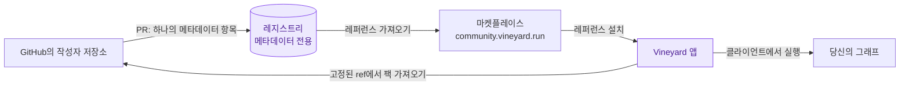

# VINEYARD.RUN용 팩 빌드, 공유 및 실행

Plugin Pack(JavaScript), Type Pack(JSON), Skill Pack(조사 플레이북)은
메타데이터 전용 GitHub 레지스트리를 통해 배포되지만, **클라이언트에서 실행**됩니다.

[마켓플레이스 둘러보기](marketplace.md){ .md-button .md-button--primary }
[사용자 가이드 읽기](guide/index.md){ .md-button }
[팩 빌드하기](develop/index.md){ .md-button }

## 여기에서 시작하세요

### :material-account: 사용자용
마켓플레이스를 둘러보고, 팩을 설치하고, 그래프에서 플러그인을 실행하고,
실행 기록을 관리하세요. → [사용자 가이드](guide/index.md)

### :material-code-braces: 개발자용
Plugin Pack, Type Pack 또는 Skill Pack을 작성하고 레지스트리에 게시하세요.
→ [개발자 가이드](develop/index.md)

### :material-file-document: 레퍼런스
팩 매니페스트와 레지스트리 항목에 대한 필드별 스키마, 그리고 스코프 카탈로그.
→ [레퍼런스](reference/index.md)

## 멘탈 모델

## 핵심 원칙

- **클라이언트 측 실행** — 서버는 플러그인 코드를 절대 실행하지 않습니다.
- **기본적으로 임시** — 저장을 선택하지 않는 한 실행 결과는 데이터베이스에 기록되지 않습니다.
- **최소 권한** — 신뢰할 수 없는 플러그인 JS는 사용자가 승인한 스코프만으로 Web Worker 샌드박스에서 실행되며, 계정 토큰이 아닌 일회성, 프로젝트 범위, 쓰기 제한 토큰을 보유한 호스트 브리지를 통해 접근합니다.
- **배포 = GitHub + 메타데이터 전용 레지스트리** — 포인터만 있고 코드는 없습니다.

전체 설계는 [아키텍처 및 원칙](develop/architecture.md)을 참조하세요.
