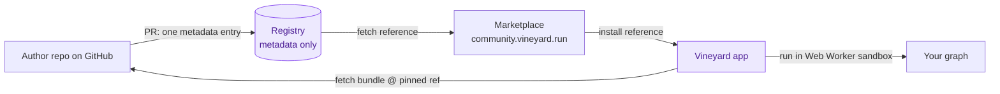

# Build, share, and run Plugin Packs & Type Packs for VINEYARD.RUN

Plugins (JavaScript) and Type Packs (JSON) are distributed over a
metadata-only GitHub registry, but they **execute on the client**.

[Browse the marketplace](marketplace.md){ .md-button .md-button--primary }
[Read the user guide](guide/index.md){ .md-button }
[Build a plugin](develop/quickstart.md){ .md-button }

## Start here

### :material-account: For users
Browse the marketplace, install plugins and Type Packs, run them on your graph, and
manage runs. → [User Guide](guide/index.md)

### :material-code-braces: For developers
Write a plugin with the SDK, define a Type Pack, declare scopes, and publish to the
registry. → [Developer Guide](develop/quickstart.md)

### :material-file-document: Reference
Field-by-field schemas for the plugin manifest, Type Packs, and registry entries, plus
the scopes catalog. → [Reference](reference/index.md)

## The mental model

## Key principles

- **Client-side execution** — the server never executes plugin code.
- **Ephemeral by default** — a run is not written to the database unless you opt in to save.
- **Least authority** — untrusted plugin JS runs in a Web Worker sandbox with only the
  scopes you approve, reached through a host bridge that holds a one-time, project-scoped,
  write-capped token — never your account token.
- **Distribution = GitHub + a metadata-only registry** — pointers, never code.

See [Architecture &amp; principles](develop/architecture.md) for the full design.
